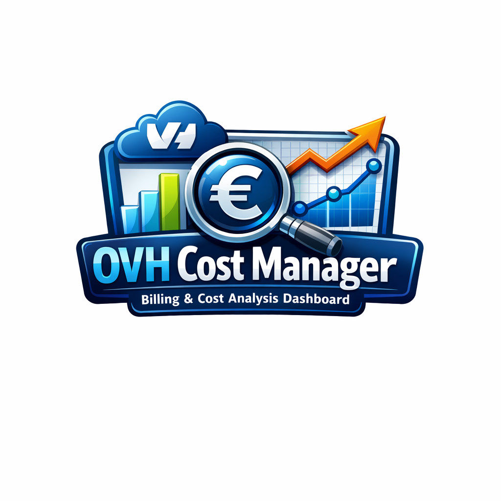
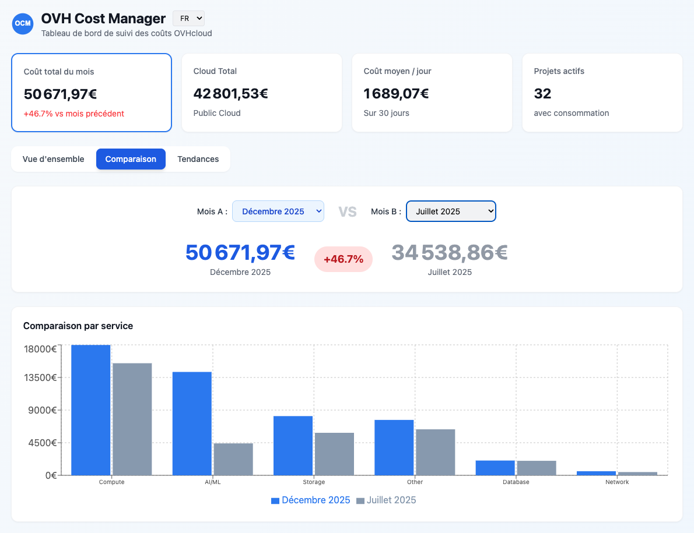
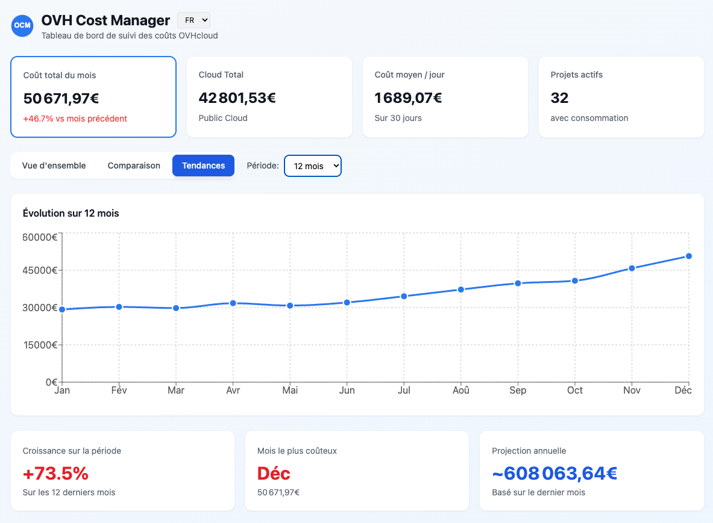

<p align="center">
  
</p>

<h1 align="center">OVH Cost Manager</h1>

<p align="center">
  <a href="https://opensource.org/licenses/MIT"></a>
  <a href="https://nodejs.org/"></a>
  <a href="https://hub.docker.com/r/mmaudet/ovh-cost-manager"></a>
</p>

<p align="center">
  Interactive dashboard for OVHcloud billing analysis with cost tracking, monthly comparisons, service breakdowns, and trend analysis.
</p>

## Screenshots

### Overview


### Month Comparison


### Historical Trends


## Features

### Dashboard
- **Interactive Dashboard**: React-based SPA with Recharts visualizations
- **Multi-language Support**: French and English interface (i18n)
- **6 navigation tabs**: Overview, Comparison, Trends, Public Cloud, Infrastructure, Backup

### Cost Analysis
- **Service Breakdown**: Costs by service type (Compute, Storage, Network, Database, AI/ML, Licenses, Backup, Support)
- **Resource Type Classification**: Automatic categorization (Public Cloud, Dedicated Servers, VPS, Storage, Load Balancers, IP, Domains, Private Cloud Hosts, Private Cloud Datastores, Licenses, Backup, Telephony)
- **Resource Type Detail**: Expandable cost breakdown per individual service within each category
- **GPU Cost Consolidation**: Dedicated view for GPU costs by model (NVIDIA L4, L40S, A100, H100) and by project
- **Month Comparison**: Side-by-side comparison between two months with variation tracking, including infrastructure, backup, Private Cloud, and per-project product breakdowns
- **Trend Analysis**: Historical trends with configurable period (3-36 months) and GPU evolution chart
- **Budget Tracking**: Visual budget consumption with configurable targets

### Real-time Monitoring
- **Current Consumption**: Live consumption data from OVH API with today's date
- **End-of-month Forecast**: Projected monthly total with progress indicator
- **Account Balance**: Debt, credits, and deposit tracking

### Infrastructure Inventory
- **Public Cloud**: Projects, instances (with GPU highlighting), quotas by region, Kubernetes clusters, Object Storage (S3) buckets with cost, Container Registry
- **Private Cloud / vSphere**: Hosts (ESXi), datastores (SSD), management fees
- **Dedicated Servers**: Full specs (CPU, RAM, datacenter, expiration, renewal) — Scale, Advance, Infra series
- **VPS**: Model, zone, specs, state
- **Storage**: NAS-HA services with size and shares
- **Backup**: Veeam Backup VMs and Enterprise licenses with cost breakdown
- **Expiring Services**: Alert for services expiring within 30 days

### Tools & Export
- **Export**: PDF and Markdown report generation, CSV exports (bills, details, inventory)
- **CLI Tools**: Download invoices, split by project, extract bills per project
- **Data Import**: Full, differential, or targeted import from OVH API into local SQLite database

## Quick Start

```bash
# Clone and install
git clone https://github.com/mmaudet/ovh-cost-manager.git
cd ovh-cost-manager
npm install

# Configure OVH API credentials (see Configuration section below)
cp config.example.json config.json
# Edit config.json with your OVH API credentials

# Import data from OVH API
npm run import:full

# Start the dashboard
npm run dev
```

Open http://localhost:5173 to view the dashboard.

> **Note**: The import requires valid OVH API credentials. See [Configuration](#configuration) for setup instructions.

## Project Structure

```
ovh-cost-manager/
├── cli/                      # Command-line tools
│   ├── index.js              # Invoice downloader
│   ├── split-by-project.js   # Cost analyzer (via OVH API)
│   └── bills-by-project.js   # Bills extractor (via local DB)
├── data/                     # Data layer
│   ├── import.js             # OVH API → SQLite import script
│   ├── db.js                 # Database connection and queries
│   ├── classify.js           # Shared classification functions
│   ├── schema.sql            # SQLite schema
│   └── ovh-bills.db          # Local database (gitignored)
├── scripts/                  # Docker & automation scripts
│   ├── entrypoint.sh         # Docker entrypoint (server + cron)
│   └── cron-import.sh        # Periodic differential import (24h)
├── server/                   # Backend API
│   └── index.js              # Express server (port 3001)
├── dashboard/                # Frontend (Vite + React)
│   └── src/
│       ├── components/       # React components (Logo, Accordion)
│       ├── hooks/            # Custom hooks (useLanguage)
│       ├── i18n/             # Translations (FR/EN)
│       ├── pages/            # Dashboard page
│       └── services/         # API client
├── docs/                     # Documentation
│   ├── deployment.md         # Docker & SSO deployment guide
│   └── screenshots/          # Dashboard screenshots
├── Dockerfile                # Docker image definition
├── docker-compose.yml        # Base deployment (without SSO)
├── docker-compose.sso.yml    # SSO extension (LemonLDAP + Traefik)
├── .dockerignore             # Docker build exclusions
└── config.example.json       # Configuration template
```

## Prerequisites

- [Node.js](https://nodejs.org/) >= 18.0.0 (for local development)
- [Docker](https://www.docker.com/) and Docker Compose (for containerized deployment)
- OVH API credentials (see [Configuration](#configuration))

## Configuration

### 1. Generate OVH API Credentials

1. Go to [OVH API Token Creation](https://eu.api.ovh.com/createToken/)
2. Log in and note your **Application Key** and **Application Secret**

### 2. Generate Consumer Key

```bash
curl -X POST \
  -H "Content-type: application/json" \
  -H "X-Ovh-Application: YOUR_APP_KEY" \
  -d '{"accessRules": [
    {"method": "GET", "path": "/me"},
    {"method": "GET", "path": "/me/*"},
    {"method": "GET", "path": "/cloud"},
    {"method": "GET", "path": "/cloud/*"},
    {"method": "GET", "path": "/dedicated/server"},
    {"method": "GET", "path": "/dedicated/server/*"},
    {"method": "GET", "path": "/dedicatedCloud"},
    {"method": "GET", "path": "/dedicatedCloud/*"},
    {"method": "GET", "path": "/ip"},
    {"method": "GET", "path": "/ip/*"},
    {"method": "GET", "path": "/ipLoadbalancing"},
    {"method": "GET", "path": "/ipLoadbalancing/*"},
    {"method": "GET", "path": "/vps"},
    {"method": "GET", "path": "/vps/*"},
    {"method": "GET", "path": "/storage"},
    {"method": "GET", "path": "/storage/*"}
  ]}' \
  https://eu.api.ovh.com/1.0/auth/credential
```

> **Minimum permissions**: `/me/*` and `/cloud/*` are required. The additional paths (`/dedicated/server/*`, `/dedicatedCloud/*`, `/vps/*`, `/storage/*`, `/ip/*`, `/ipLoadbalancing/*`) enable the full infrastructure inventory. The dashboard works without them but inventory data will be limited.

Visit the `validationUrl` in the response to authorize the application.

### 3. Create Configuration File

Create `config.json` at project root or `$HOME/my-ovh-bills/config.json`:

```json
{
  "credentials": {
    "appKey": "YOUR_APP_KEY",
    "appSecret": "YOUR_APP_SECRET",
    "consumerKey": "YOUR_CONSUMER_KEY",
    "endpoint": "ovh-eu"
  },
  "dashboard": {
    "budget": 50000,
    "currency": "EUR",
    "language": "fr"
  }
}
```

> **Language options**: `"fr"` (French) or `"en"` (English). Can also be changed via the UI.

> **Note**: Legacy format (`credentials.json` with flat structure) is still supported.

## Usage

### Import Data

```bash
# Full import (all historical data)
npm run import:full

# Import specific period
npm run import -- --from 2025-01-01 --to 2025-12-31

# Differential import (new data since last import)
npm run import:diff

# Include consumption data (real-time + forecast)
npm run import -- --from 2025-01-01 --include-consumption

# Include infrastructure inventory (servers, VPS, storage)
npm run import -- --from 2025-01-01 --include-inventory

# Include cloud project details (instances, quotas)
npm run import -- --from 2025-01-01 --include-cloud-details

# Import everything
npm run import -- --from 2025-01-01 --all
```

### Start Dashboard

```bash
# Development (server + frontend)
npm run dev

# Or separately:
npm run dev:server    # Backend on :3001
npm run dev:dashboard # Frontend on :5173
```

### CLI Tools

```bash
# Download invoices
npm run cli -- --from=2025-01-01 --to=2025-12-31

# Generate markdown summary
npm run cli -- --from=2025-01-01 --summary

# Split by project via OVH API (JSON)
npm run split -- --from 2025-12-01 --to 2025-12-31

# Split by project via OVH API (Markdown)
npm run split -- --from 2025-12-01 --to 2025-12-31 --format md

# Extract bills from local DB
npm run bills -- --list                              # List all projects
npm run bills -- --project "AI"                      # All bills for project
npm run bills -- --project "AI" --from 2025-01-01 --to 2025-12-31
npm run bills -- --project "AI" --format md          # Markdown output
npm run bills -- --month 2025-12                     # All bills for a month
npm run bills -- --month 2025-12 --format md         # Markdown output
```

## Docker Deployment

Two deployment modes are available:
- **Simple**: OCM only, direct access on port 3001
- **SSO**: Full stack with Traefik reverse proxy and LemonLDAP-NG authentication

> **Detailed documentation**: See [docs/deployment.md](docs/deployment.md) for complete deployment guide, including SAML and OIDC configuration with LemonLDAP-NG.

### Option 1: Simple Deployment (without SSO)

```bash
# Build and start
docker-compose up -d --build

# View logs
docker-compose logs -f ocm
```

Access the dashboard at http://localhost:3001

> **Automatic import**: On first start, a full import runs automatically if the database is empty. Then a differential import runs every 24 hours. Configure with `IMPORT_INTERVAL`, `IMPORT_FLAGS`, or disable with `IMPORT_ENABLED=false`.

#### Environment Variables (Simple)

| Variable | Description | Default |
|----------|-------------|---------|
| `OCM_PORT` | Exposed port | 3001 |
| `AUTH_REQUIRED` | Require auth headers | false |
| `IMPORT_ENABLED` | Enable automatic periodic import | true |
| `IMPORT_INTERVAL` | Seconds between imports | 86400 (24h) |
| `IMPORT_FLAGS` | Extra flags for import script | --all |

### Option 2: SSO Deployment (with LemonLDAP-NG)

```bash
# Build and start full stack
docker-compose -f docker-compose.yml -f docker-compose.sso.yml up -d --build

# View logs
docker-compose -f docker-compose.yml -f docker-compose.sso.yml logs -f
```

Access the dashboard at http://ocm.localhost (or your configured domain).

#### Architecture (SSO)

```
┌─────────────┐    ┌─────────────┐    ┌─────────────┐
│   Traefik   │───▶│  LemonLDAP  │───▶│     OCM     │
│   (:80)     │    │  (handler)  │    │   (:3001)   │
└─────────────┘    └─────────────┘    └─────────────┘
```

#### Environment Variables (SSO)

Create a `.env` file:

```bash
# Domain configuration
OCM_DOMAIN=ocm.example.com
SSO_DOMAIN=example.com
```

#### Docker Compose Services (SSO)

| Service | Description | Port |
|---------|-------------|------|
| `ocm` | OVH Cost Manager | internal |
| `traefik` | Reverse proxy | 80, 8080 (dashboard) |
| `lemonldap` | SSO Portal | internal |

#### SSO Configuration (LemonLDAP-NG)

1. Access the LemonLDAP Manager at http://manager.localhost
2. Create a virtual host for your OCM domain
3. Configure exported headers:
   - `Auth-User` → `$uid`
   - `Auth-Mail` → `$mail`
   - `Auth-CN` → `$cn`

### Volume Mounts

| Volume | Purpose | Mode |
|--------|---------|------|
| `ocm-data` | SQLite database | Both |
| `lemonldap-conf` | LemonLDAP configuration | SSO only |
| `lemonldap-sessions` | SSO session storage | SSO only |

### Production Deployment

For production with SSO:

1. Configure proper domain names in `.env`
2. Add HTTPS with Let's Encrypt (Traefik supports it)
3. Connect LemonLDAP to your LDAP/AD directory
4. Use external volume or backup strategy for data

## API Endpoints

### Billing & Analysis

| Endpoint | Description |
|----------|-------------|
| `GET /api/months` | Available months for selection |
| `GET /api/summary?from=&to=` | Summary with totals |
| `GET /api/bills?from=&to=` | List bills in date range |
| `GET /api/analysis/by-project?from=&to=` | Costs grouped by project |
| `GET /api/analysis/by-service?from=&to=` | Costs grouped by service type |
| `GET /api/analysis/by-resource-type?from=&to=` | Costs grouped by resource type |
| `GET /api/analysis/resource-type-details?type=&from=&to=` | Detail for a specific resource type |
| `GET /api/analysis/public-cloud-stats?from=&to=` | Public Cloud stats (K8s, S3, Registry) |
| `GET /api/analysis/backup-stats?from=&to=` | Backup stats (Veeam VMs, Enterprise licenses) |
| `GET /api/analysis/daily-trend?from=&to=` | Daily cost trend |
| `GET /api/analysis/monthly-trend?months=6` | Monthly cost trend |

### Consumption & Account

| Endpoint | Description |
|----------|-------------|
| `GET /api/consumption/current` | Current consumption (real-time) |
| `GET /api/consumption/forecast` | End-of-month forecast |
| `GET /api/consumption/usage-history?from=&to=` | Consumption history |
| `GET /api/account/balance` | Debt, credits, deposits |
| `GET /api/account/credits` | Credit movements |

### Inventory

| Endpoint | Description |
|----------|-------------|
| `GET /api/projects` | List all Cloud projects |
| `GET /api/projects/enriched` | Projects with instance count and consumption |
| `GET /api/projects/:id/consumption?from=&to=` | Project consumption by resource |
| `GET /api/projects/:id/instances` | Project instances |
| `GET /api/projects/:id/quotas` | Project quotas by region |
| `GET /api/projects/:id/buckets?from=&to=` | Project S3 buckets with cost |
| `GET /api/projects/:id/instance-total?from=&to=` | Project instance total cost |
| `GET /api/inventory/servers` | Dedicated servers list |
| `GET /api/inventory/vps` | VPS instances list |
| `GET /api/inventory/storage` | Storage services list |
| `GET /api/inventory/summary` | Resource count summary |
| `GET /api/inventory/expiring?days=30` | Services expiring soon |

### GPU & System

| Endpoint | Description |
|----------|-------------|
| `GET /api/gpu/summary?from=&to=` | GPU costs by model, project, trend |
| `GET /api/import/status` | Import history and status |
| `GET /api/config` | Dashboard configuration |
| `GET /api/user` | Current authenticated user info |
| `GET /api/health` | Health check endpoint |
| `GET /api/export/bills?from=&to=` | CSV export of bills |
| `GET /api/export/details?from=&to=` | CSV export of bill details |

## Contributing

See [CONTRIBUTING.md](CONTRIBUTING.md) for guidelines.

## License

MIT License - see [LICENSE.txt](LICENSE.txt)

## Author

**Michel-Marie MAUDET** - [mmaudet@linagora.com](mailto:mmaudet@linagora.com)

### Contributors

- **[Olivier Pernes](https://github.com/opernes)** — Improved service classification, Private Cloud/Backup support, parallel API imports

*This project was inspired by the work of [Somanos Sar](https://github.com/somanos/ovh-bill).*
