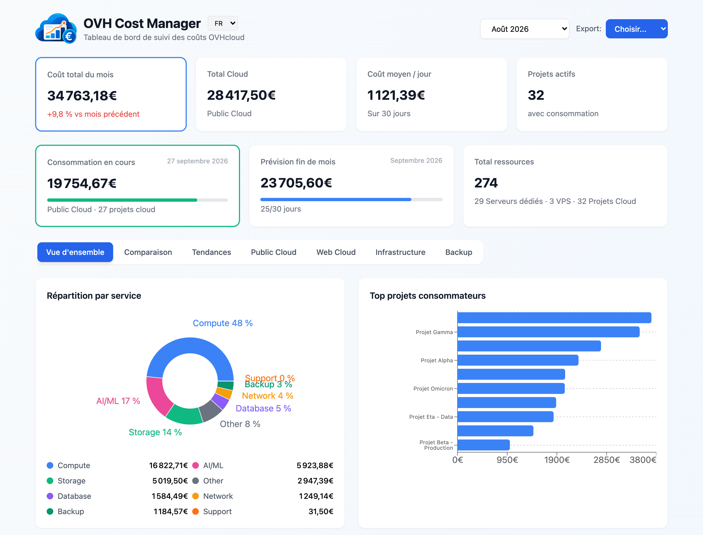
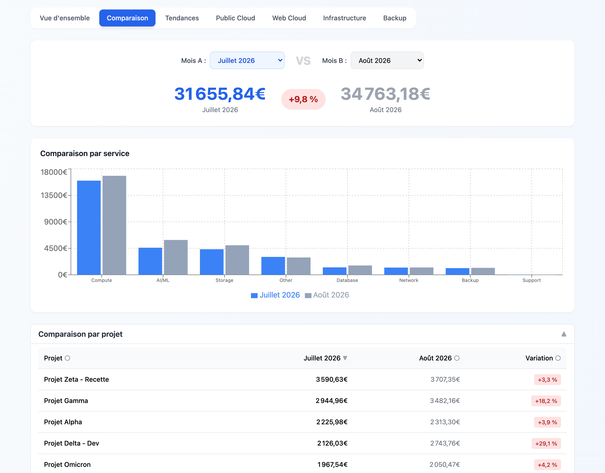
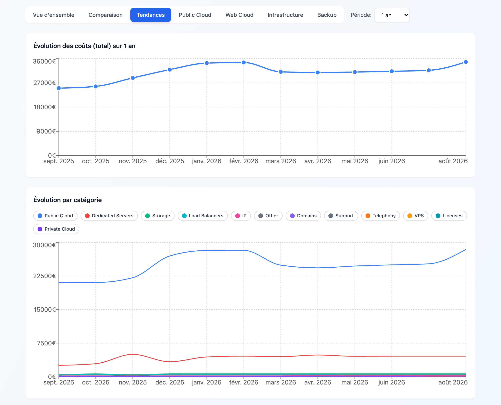
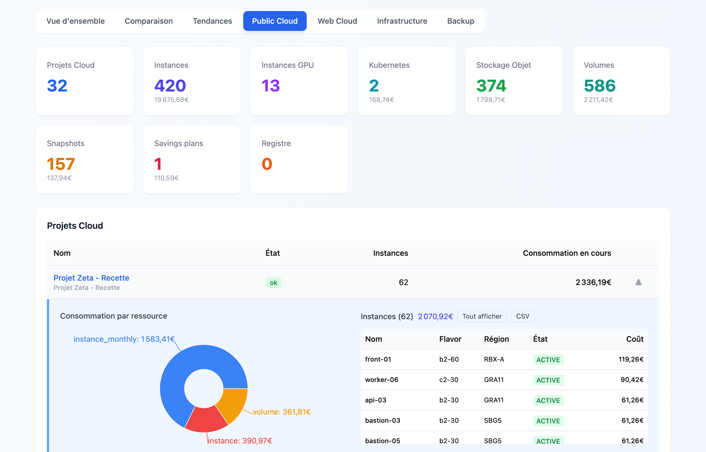
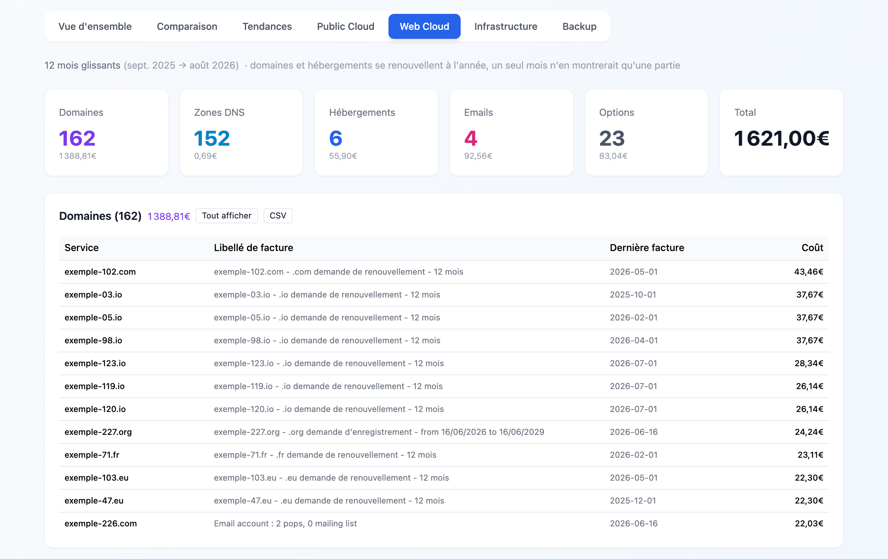

<p align="center">
  <picture>
    <source media="(prefers-color-scheme: dark)" srcset="docs/logo-dark.png">
    
  </picture>
</p>

<h1 align="center">OVH Cost Manager</h1>

<p align="center">
  <a href="https://opensource.org/licenses/MIT"></a>
  <a href="https://nodejs.org/"></a>
  <a href="https://hub.docker.com/r/mmaudet/ovh-cost-manager"></a>
  <a href="CHANGELOG.md"></a>
</p>

<p align="center">
  Interactive dashboard for OVHcloud billing analysis with cost tracking, monthly comparisons, service breakdowns, and trend analysis.
</p>

## Screenshots

The screenshots show anonymised data.

### Overview


### Month Comparison


### Historical Trends


### Public Cloud


### Web Cloud


## Features

### Dashboard
- **Interactive Dashboard**: React-based SPA with Recharts visualizations
- **Multi-language Support**: French and English interface (i18n)
- **7 navigation tabs**: Overview, Comparison, Trends, Public Cloud, Web Cloud, Infrastructure, Backup
- **Several OVH Accounts**: one instance imports several accounts; a selector in the header narrows every tab down to one, and with all accounts shown, the lists name each row's account

### Cost Analysis
- **Service Breakdown**: Costs by service type (Compute, Storage, Network, Database, AI/ML, Licenses, Backup, Support)
- **Resource Type Classification**: Automatic categorization (Public Cloud, Dedicated Servers, VPS, Storage, Load Balancers, IP, Domains, Private Cloud Hosts, Private Cloud Datastores, Licenses, Backup, Telephony)
- **Resource Type Detail**: Expandable cost breakdown per individual service within each category
- **GPU Cost Consolidation**: Dedicated view for GPU costs by model (NVIDIA L4, L40S, A100, H100) and by project
- **Month Comparison**: Side-by-side comparison between two months with variation tracking, including infrastructure, backup, Private Cloud, and per-project product breakdowns
- **Trend Analysis**: Historical trends with configurable period (3-36 months) and GPU evolution chart
- **Budget Tracking**: Visual budget consumption with configurable targets

### Real-time Monitoring
- **Current Consumption**: Live consumption data from OVH API with today's date
- **End-of-month Forecast**: Projected monthly total with progress indicator
- **Account Balance**: Debt, credits, and deposit tracking

### Infrastructure Inventory
- **Public Cloud**: Projects, instances (with GPU highlighting), quotas by region, Kubernetes clusters, Object Storage (S3) buckets with cost, Container Registry
- **Private Cloud / vSphere**: Hosts (ESXi), datastores (SSD), management fees
- **Dedicated Servers**: Full specs (CPU, RAM, datacenter, expiration, renewal) — Scale, Advance, Infra series
- **VPS**: Model, zone, specs, state
- **Storage**: NetApp storage services with size and number of shares
- **Backup**: Veeam Backup VMs and Enterprise licenses with cost breakdown
- **Expiring Services**: Lists the services expired or expiring within 30 days, soonest first

### Tools & Export
- **Export**: PDF and Markdown report generation, CSV exports (bills, details, inventory)
- **CLI Tools**: Download invoices, split by project, extract bills per project
- **Data Import**: Full, differential, or targeted import from OVH API into local SQLite database

## Quick Start

```bash
# Clone and install
git clone https://github.com/mmaudet/ovh-cost-manager.git
cd ovh-cost-manager
npm install

# Configure OVH API credentials (see Configuration section below)
cp config.example.json config.json
# Edit config.json with your OVH API credentials

# Import data from OVH API
npm run import:full

# Start the dashboard
npm run dev
```

Open http://localhost:5173 to view the dashboard.

> **Note**: The import requires valid OVH API credentials. See [Configuration](#configuration) for setup instructions.

## Project Structure

```
ovh-cost-manager/
├── cli/                      # Command-line tools
│   ├── index.js              # Invoice downloader
│   ├── split-by-project.js   # Cost analyzer (via OVH API)
│   └── bills-by-project.js   # Bills extractor (via local DB)
├── data/                     # Data layer
│   ├── import.js             # OVH API → SQLite import script
│   ├── db.js                 # Database connection and queries
│   ├── classify.js           # Shared classification functions
│   ├── schema.sql            # SQLite schema
│   └── ovh-bills.db          # Local database (gitignored)
├── scripts/                  # Docker & automation scripts
│   ├── entrypoint.sh         # Docker entrypoint (server + cron)
│   └── cron-import.sh        # Periodic differential import (24h)
├── server/                   # Backend API
│   └── index.js              # Express server (port 3001)
├── dashboard/                # Frontend (Vite + React)
│   └── src/
│       ├── components/       # React components (Logo, Accordion)
│       ├── hooks/            # Custom hooks (useLanguage)
│       ├── i18n/             # Translations (FR/EN)
│       ├── pages/            # Dashboard page
│       └── services/         # API client
├── docs/                     # Documentation
│   ├── deployment.md         # Docker & SSO deployment guide
│   └── screenshots/          # Dashboard screenshots
├── Dockerfile                # Docker image definition
├── docker-compose.yml        # Base deployment (without SSO)
├── docker-compose.sso.yml    # SSO deployment (LemonLDAP-NG + OIDC)
├── .dockerignore             # Docker build exclusions
├── config.example.json       # Configuration template
└── config.accounts.example.json  # Configuration template, several accounts
```

## Prerequisites

- [Node.js](https://nodejs.org/) >= 22 for local development (24 recommended, the version of the Docker image and the CI)
- [Docker](https://www.docker.com/) and Docker Compose (for containerized deployment)
- OVH API credentials (see [Configuration](#configuration))

## Configuration

### 1. Generate OVH API Credentials

1. Go to [OVH API Token Creation](https://eu.api.ovh.com/createToken/)
2. Log in and note your **Application Key** and **Application Secret**

### 2. Generate Consumer Key

```bash
curl -X POST \
  -H "Content-type: application/json" \
  -H "X-Ovh-Application: YOUR_APP_KEY" \
  -d '{"accessRules": [
    {"method": "GET", "path": "/me"},
    {"method": "GET", "path": "/me/*"},
    {"method": "GET", "path": "/cloud"},
    {"method": "GET", "path": "/cloud/*"},
    {"method": "GET", "path": "/dedicated/server"},
    {"method": "GET", "path": "/dedicated/server/*"},
    {"method": "GET", "path": "/dedicatedCloud"},
    {"method": "GET", "path": "/dedicatedCloud/*"},
    {"method": "GET", "path": "/ip"},
    {"method": "GET", "path": "/ip/*"},
    {"method": "GET", "path": "/ipLoadbalancing"},
    {"method": "GET", "path": "/ipLoadbalancing/*"},
    {"method": "GET", "path": "/vps"},
    {"method": "GET", "path": "/vps/*"},
    {"method": "GET", "path": "/storage"},
    {"method": "GET", "path": "/storage/*"},
    {"method": "POST", "path": "/me/carbonCalculator/csv"}
  ]}' \
  https://eu.api.ovh.com/1.0/auth/credential
```

> **Minimum permissions**: `GET /me`, `/me/*` and `/cloud/*` are required. Every import reads the account it imports from `GET /me`, which `/me/*` does not cover: a key without it fails every import. The additional paths (`/dedicated/server/*`, `/dedicatedCloud/*`, `/vps/*`, `/storage/*`, `/ip/*`, `/ipLoadbalancing/*`) enable the full infrastructure inventory. The dashboard works without them but inventory data will be limited. The optional `POST /me/carbonCalculator/csv` lets the import ask OVHcloud's carbon calculator for the account's carbon footprint (`--include-carbon`, which `--all` includes): it only asks OVHcloud to generate the file, which `GET /me/*` then reads. Without it, the import says which right the key lacks, and imports the rest. Any other failure of the footprint's import counts among the failed items, and replaces nothing.

Visit the `validationUrl` in the response to authorize the application.

### 3. Create Configuration File

Create `config.json` at project root or `$HOME/my-ovh-bills/config.json`:

```json
{
  "credentials": {
    "appKey": "YOUR_APP_KEY",
    "appSecret": "YOUR_APP_SECRET",
    "consumerKey": "YOUR_CONSUMER_KEY",
    "endpoint": "ovh-eu"
  },
  "dashboard": {
    "budget": 50000,
    "currency": "EUR",
    "language": "fr"
  }
}
```

> **Language options**: `"fr"` (French) or `"en"` (English). Can also be changed via the UI.

> **`dataDir`**: Optional. Directory where the SQLite database is stored. Defaults to `data/` within the project. Can also be set via the `DATA_DIR` environment variable (which takes precedence). The Docker Compose files set `DATA_DIR=/data`, where the `ocm-data` volume is mounted.

> **Note**: Legacy format (`credentials.json` with flat structure) is still supported.

### Several OVH Accounts

One instance can import several OVH accounts, such as one per subsidiary. List them in an `accounts` section, in place of `credentials`, as in [config.accounts.example.json](config.accounts.example.json):

```json
{
  "accounts": [
    {
      "name": "Filiale Lyon",
      "budget": 30000,
      "credentials": {
        "appKey": "LYON_APP_KEY",
        "appSecret": "LYON_APP_SECRET",
        "consumerKey": "LYON_CONSUMER_KEY",
        "endpoint": "ovh-eu"
      }
    },
    {
      "name": "Filiale Paris",
      "credentials": { ... }
    }
  ],
  "dashboard": { ... }
}
```

Each entry has:

- **`name`**, optional and unique: how the dashboard names the account, its NIC handle otherwise.
- **`budget`**, optional, a positive integer: the account's own budget, which the budget card uses when that account is selected. `dashboard.budget` stays the budget of all accounts.
- **`credentials`**, required: the account's keys, and its `endpoint`, which is required here, unlike in the `credentials` section. Request a consumer key for each account as above, and open its `validationUrl` as that account. Each key needs `GET /me`.

With several accounts:

- **One currency**: every account must bill in the currency of the first one. An account that bills in another fails its import.
- **One form**: `accounts` cannot be set with `credentials`, nor with the legacy flat form. A malformed section stops the server and the import, naming the setting. The accounts have no environment variables.
- **Import**: each import imports every account, one after the other, and a differential import starts each account from its own latest bill. An account that fails does not stop the others: the run then ends `partial`. `--account <NIC handle>` limits a run to one account (see [Import Data](#import-data)).
- **Dashboard**: it shows all accounts by default. A selector in the header narrows every tab down to one, and with all accounts shown, the lists and their CSV exports gain an Account column.
- **Upgrading**: the first import after the upgrade gives the data stored before it an account, on its own. A single account gets it all. With several, each account claims what its API lists, and an account that claimed every bill gets the rest; what no account claims shows as the Unknown account. So upgrade with the one account you had, and add the others once its first import has run: no Unknown account then shows.
- **Removed accounts**: an account removed from `config.json` keeps its data, and shows as not configured. It is no longer imported.

The [deployment guide](docs/deployment.md#several-ovh-accounts) details each point, and its [upgrade notes](docs/deployment.md#upgrading-to-several-accounts) what the first import after the upgrade does.

## Rate Limiting

The API server includes rate limiting to protect against DoS attacks and brute-force attempts. This protection is **enabled by default** but fully configurable.

### Default Limits

| Endpoint  | Limit        | Window     | Per        |
| --------- | ------------ | ---------- | ---------- |
| `/api/*`  | 100 requests | 15 minutes | IP address |
| `/auth/*` | 20 requests  | 15 minutes | IP address |

### Configuration via config.json

Add a `rateLimit` section to your `config.json`, as in [config.example.json](config.example.json):

```json
{
  "credentials": { ... },
  "dashboard": { ... },
  "rateLimit": {
    "enabled": true,
    "trustProxy": false,
    "api": {
      "windowMs": 900000,
      "max": 100
    },
    "auth": {
      "windowMs": 900000,
      "max": 20
    }
  }
}
```

**Parameters**:
- `enabled`: Enable/disable globally (default: `true`)
- `trustProxy`: The number of proxies in front of OCM whose `X-Forwarded-For` it trusts, from 1 to 10, `true` for one, `false` for none; with one or more, it also trusts `X-Forwarded-Host` for the CORS check and `ALLOWED_HOSTS`, and `X-Forwarded-Proto` for the CORS check (default: `false`)
- `api.windowMs`: Window duration in milliseconds (default: `900000` = 15 min)
- `api.max`: Maximum API requests per IP per window (default: `100`)
- `auth.windowMs`: Window duration for authentication endpoints (default: `900000`)
- `auth.max`: Maximum authentication requests per IP (default: `20`)

### Configuration via Environment Variables

Environment variables take **priority** over `config.json`:

```bash
# Enable/disable
RATE_LIMIT_ENABLED=true|false

# Trust proxy (CRITICAL for Kubernetes/reverse proxy): true trusts one
TRUST_PROXY=true|false|<number of proxies, 1 to 10>

# API limits
RATE_LIMIT_API_WINDOW_MS=900000    # 15 minutes
RATE_LIMIT_API_MAX=100             # 100 requests

# Authentication limits
RATE_LIMIT_AUTH_WINDOW_MS=900000   # 15 minutes
RATE_LIMIT_AUTH_MAX=20             # 20 requests
```

**Docker/Kubernetes Example**:
```yaml
environment:
  - TRUST_PROXY=true
  - RATE_LIMIT_API_MAX=500
  - RATE_LIMIT_AUTH_MAX=100
```

### Disabling Rate Limiting

For internal applications secured by upstream SSO:

```bash
# Via environment variable
RATE_LIMIT_ENABLED=false

# Or in config.json
{
  "rateLimit": {
    "enabled": false
  }
}
```

### ⚠️ IMPORTANT: Kubernetes / Reverse Proxy Deployments

**Problem**: By default, the server identifies clients by their IP address. Behind a reverse proxy (Kubernetes Ingress, Traefik, nginx), **all requests** appear to come from the same IP (the proxy/ingress IP). Result: all users share the same global limit.

**Symptoms**:
- 429 "Too many requests" errors after only a few dozen requests
- Multiple users are blocked simultaneously
- The problem is amplified if users connect through a corporate VPN (single IP)

**Required Solution**:

You **must** enable `trustProxy` so the server uses the `X-Forwarded-For` header:

```bash
# Via environment variable (recommended)
TRUST_PROXY=true

# Or in config.json
{
  "rateLimit": {
    "trustProxy": true
  }
}
```

Once enabled, each user is identified by their real IP address and gets their own individual limit. Behind several proxies, set their number instead, counted as the [deployment guide](docs/deployment.md#rate-limiting-for-kubernetesreverse-proxy) says.

**Alternative**: If your application is 100% internal and protected by SSO, you can completely disable rate limiting (`RATE_LIMIT_ENABLED=false`).

> **Note**: Standard `RateLimit-*` headers are included in responses to indicate remaining limits. Check `RateLimit-Limit`, `RateLimit-Remaining`, and `RateLimit-Reset` headers.

## Usage

### Import Data

```bash
# Full import (all historical data)
npm run import:full

# Import specific period
npm run import -- --from 2025-01-01 --to 2025-12-31

# Differential import (new data since last import)
npm run import:diff

# Include consumption data (real-time + forecast)
npm run import -- --from 2025-01-01 --include-consumption

# Include infrastructure inventory (servers, VPS, storage)
npm run import -- --from 2025-01-01 --include-inventory

# Include cloud project details (instances, quotas)
npm run import -- --from 2025-01-01 --include-cloud-details

# Include the carbon footprint of the last 24 months, which OVHcloud's carbon calculator gives
npm run import -- --diff --include-carbon

# Import everything
npm run import -- --from 2025-01-01 --all

# Several accounts: import one account alone, by its NIC handle
npm run import -- --diff --all --account xx1111-ovh

# Several accounts: clear and reimport one account alone
npm run import -- --full --all --account xx1111-ovh
```

With several accounts, each run imports every account, one after the other, under one entry of the import history. An account that fails does not stop the others: the run then ends `partial`, and names it, or `failed` when every account did. The import's output names each account's NIC handle. `--full` clears each account that it can import, and keeps the data of the others (see the [deployment guide](docs/deployment.md#importing-several-accounts)). Give it `--all`: it clears the account's inventory, balance, consumption history and credit movements too, and fetches again only the datasets that its flags ask for.

### Start Dashboard

```bash
# Development (server + frontend)
npm run dev

# Or separately:
npm run dev:server    # Backend on :3001
npm run dev:dashboard # Frontend on :5173
```

### CLI Tools

```bash
# Download invoices
npm run cli -- --from=2025-01-01 --to=2025-12-31

# Generate markdown summary
npm run cli -- --from=2025-01-01 --summary

# Split by project via OVH API (JSON)
npm run split -- --from 2025-12-01 --to 2025-12-31

# Split by project via OVH API (Markdown)
npm run split -- --from 2025-12-01 --to 2025-12-31 --format md

# Extract bills from local DB
npm run bills -- --list                              # List all projects
npm run bills -- --project "AI"                      # All bills for project
npm run bills -- --project "AI" --from 2025-01-01 --to 2025-12-31
npm run bills -- --project "AI" --format md          # Markdown output
npm run bills -- --month 2025-12                     # All bills for a month
npm run bills -- --month 2025-12 --format md         # Markdown output
```

## Docker Deployment

Two deployment modes are available. The [deployment guide](docs/deployment.md) describes both, with every setting, and is the reference for them:
- **Simple** (`docker-compose.yml`): OCM only, direct access on port 3001
- **SSO** (`docker-compose.sso.yml`, used on its own): OCM behind LemonLDAP-NG, its OpenID Connect (OIDC) provider and reverse proxy

### Option 1: Simple Deployment (without SSO)

```bash
# Build and start
docker-compose up -d --build

# View logs
docker-compose logs -f ocm
```

Access the dashboard at http://localhost:3001

> **Automatic import**: at start, the container runs a full import when its database holds no bill, then a differential import every 24 hours. Configure them with `IMPORT_INTERVAL` and `IMPORT_FLAGS`. `IMPORT_ENABLED=false` turns them off, and the dashboard's resync button with them (see the [deployment guide](docs/deployment.md#3-import-billing-data)).

The container's settings, such as `ALLOWED_HOSTS` against DNS rebinding, `TRUST_PROXY` behind a reverse proxy, or OIDC sign-in, are listed in the [deployment guide](docs/deployment.md#environment-variables).

### Option 2: SSO Deployment (with LemonLDAP-NG)

```bash
# Build and start the stack (the file is used on its own)
docker-compose -f docker-compose.sso.yml up -d --build

# View logs
docker-compose -f docker-compose.sso.yml logs -f
```

LemonLDAP-NG is the OIDC provider and the only way in to OCM: open http://ocm.localhost and sign in with one of the demo accounts that [demo/README.md](demo/README.md#before-any-real-use) lists. The [deployment guide](docs/deployment.md#sso-deployment-with-lemonldap-ng) covers another domain, and what to replace before any real use.

### Volume Mounts

| Volume               | Purpose                   | Mode     |
| -------------------- | ------------------------- | -------- |
| `ocm-data`           | SQLite database (`/data`) | Both     |
| `lemonldap-conf`     | LemonLDAP configuration   | SSO only |
| `lemonldap-sessions` | SSO session storage       | SSO only |

> **Upgrading from 2.2.0 or earlier**: `ocm-data` used to be mounted on `/app/data`, where the image also ships the data-layer code. Docker copied that code into the volume on first start, so later image updates never reached it. Both compose files now mount the volume on `/data` and set `DATA_DIR=/data`: the existing volume and its database are picked up as is, just recreate the container as for any update. If you run the image with `docker run` or your own compose file, make the same change.
>
> Bill lines are classified at import time, so classification fixes only apply to bills imported afterwards. To reclassify past bills, re-import a period: `docker exec ovh-cost-manager node /app/data/import.js --from 2025-01-01 --all`. A `--diff` import skips bills already in the database, and `--full` clears it first.

### Production Deployment

Before going to production, go through the [production checklist](docs/deployment.md#production-checklist) of the deployment guide: HTTPS, secrets, the demo's key pair and accounts, the reverse proxy settings, and backups.

## API Endpoints

For an instance of [several accounts](#several-ovh-accounts), every route that lists or adds up data takes an optional `account` parameter, `/api/bills`, `/api/analysis/daily-trend` and the four [CSV exports](#csv-exports) included:

- the NIC handle of an account that `GET /api/accounts` lists, such as `?account=xx1111-ovh`;
- `unknown`, for the Unknown account: the data stored before the upgrade that no account claimed;
- none, for all accounts, as before.

Any other value gets a 400. The routes of one bill or one project, such as `/api/bills/:id` or `/api/projects/:id/instances`, need no parameter, as that bill or project belongs to one account. Without the parameter, the account-wide figures (the month's consumption, its forecast, the balance and the consumption history) add up the accounts. The rows that belong to an account, such as projects, services and credit movements, name it in an `account` field: its NIC handle, or `null` for the Unknown account. With several accounts, the CSV exports gain a last `account` column. `byAccount=true` on `/api/analysis/by-project`, `/api/analysis/resource-type-details` and `/api/gpu/summary` gives a project or a service billed to several accounts once for each account, with its account.

### Accounts

| Endpoint            | Description                                                                                                        |
| ------------------- | ------------------------------------------------------------------------------------------------------------------ |
| `GET /api/accounts` | The accounts: `id`, `nic`, `name`, `currency`, `configured`, `unknown`, `lastImport`, `lastSuccessAt` and `budget` |

The route lists the accounts that the imports recorded: those that the configuration of the last import listed, in its order, then the others, then the Unknown account while it holds data. `id` is the value of the `account` parameter: the NIC handle, `nic`, or `unknown` for the Unknown account, whose `nic`, `name` and `currency` are `null`. `name` is the configured name, as the account's last import recorded it, or else the NIC handle; `configured`, whether the configuration of the last import listed the account; `unknown`, whether it is the Unknown account. `lastImport` gives when the account's last import ended, with its `status` and `error`, or `null` until one has; `lastSuccessAt`, when its last successful import ended. `budget` is the account's own budget, or `null`. An empty database lists no account, and a database not imported since the upgrade the Unknown account alone.

### Billing & Analysis

| Endpoint                                                  | Description                                   |
| --------------------------------------------------------- | --------------------------------------------- |
| `GET /api/months`                                         | Available months for selection                |
| `GET /api/summary?from=&to=`                              | Summary with totals                           |
| `GET /api/bills?from=&to=&account=`                       | List bills in date range                      |
| `GET /api/analysis/by-project?from=&to=`                  | Costs grouped by project                      |
| `GET /api/analysis/by-service?from=&to=`                  | Costs grouped by service type                 |
| `GET /api/analysis/by-resource-type?from=&to=`            | Costs grouped by resource type                |
| `GET /api/analysis/resource-type-details?type=&from=&to=` | Detail for a specific resource type           |
| `GET /api/analysis/public-cloud-stats?from=&to=`          | Public Cloud stats (K8s, S3, Registry)        |
| `GET /api/analysis/backup-stats?from=&to=`                | Backup stats (Veeam VMs, Enterprise licenses) |
| `GET /api/analysis/daily-trend?from=&to=&account=`        | Daily cost trend                              |
| `GET /api/analysis/monthly-trend?months=6&end=YYYY-MM`    | Monthly cost trend, `months` ending on `end`  |

The monthly trend covers `months` calendar months, from 1 to 240, 6 by
default, that end on the `end` month, that one included: `?months=3&end=2026-09`
covers July to September 2026. Without `end`, it ends on the month of the
latest bill. It gives each of those months, at 0 for a month without any bill,
or none when none of them has a bill.

### Consumption & Account

| Endpoint                                       | Description                     |
| ---------------------------------------------- | ------------------------------- |
| `GET /api/consumption/current`                 | Current consumption (real-time) |
| `GET /api/consumption/forecast`                | End-of-month forecast           |
| `GET /api/consumption/usage-history?from=&to=` | Consumption history             |
| `GET /api/account/balance`                     | Debt, credits, deposits         |
| `GET /api/account/credits`                     | Credit movements                |

### Carbon Footprint

| Endpoint                                  | Description                                                                                                                                                  |
| ----------------------------------------- | ------------------------------------------------------------------------------------------------------------------------------------------------------------ |
| `GET /api/carbon/footprint?month=YYYY-MM` | A month's carbon footprint, location-based, by emission source and in total, in kg CO2eq, its market-based total, the latest month that has one, and the accounts without one |
| `GET /api/carbon/trend?end=YYYY-MM`       | The carbon footprint of the 12 months that end on `end`, location-based, by emission source and in total, `null` for a month without one |

The carbon footprint is what OVHcloud's carbon calculator attributes to the accounts' services: `footprint` gives its `manufacturing`, `electricity`, `operations` and `total`, location-based, and its `marketBasedTotal`, which counts OVHcloud's low-carbon energy contracts instead of the local electricity mix; it is `null` for a month without one, such as the current month. `latestMonth` is the latest month that has one, or `null` when none has. Without the `account` parameter, `accountsWithoutFootprint` names the accounts without a footprint that month, which the sum leaves out: the configured ones, in the configuration's order, then those no longer configured that were billed that month. It is `null` with the parameter.

### Inventory

| Endpoint                                         | Description                                  |
| ------------------------------------------------ | -------------------------------------------- |
| `GET /api/projects`                              | List all Cloud projects                      |
| `GET /api/projects/enriched`                     | Projects with instance count and consumption |
| `GET /api/projects/:id/consumption?from=&to=`    | Project consumption by resource              |
| `GET /api/projects/:id/instances`                | Project instances                            |
| `GET /api/projects/:id/quotas`                   | Project quotas by region                     |
| `GET /api/projects/:id/buckets?from=&to=`        | Project S3 buckets with cost                 |
| `GET /api/projects/:id/instance-total?from=&to=` | Project instance total cost                  |
| `GET /api/inventory/servers`                     | Dedicated servers list                       |
| `GET /api/inventory/vps`                         | VPS instances list                           |
| `GET /api/inventory/storage`                     | Storage services list                        |
| `GET /api/inventory/summary`                     | Resource count summary                       |
| `GET /api/inventory/expiring?days=30`            | Expired and expiring services, soonest first |

### GPU & System

| Endpoint                         | Description                        |
| -------------------------------- | ---------------------------------- |
| `GET /api/gpu/summary?from=&to=` | GPU costs by model, project, trend |
| `GET /api/import/status`         | Import history and status          |
| `GET /api/config`                | Dashboard configuration            |
| `GET /api/user`                  | Current authenticated user info    |
| `GET /api/health`                | Health check endpoint              |

### CSV Exports

| Endpoint                               | Description                                 |
| -------------------------------------- | ------------------------------------------- |
| `GET /api/export/bills?from=&to=`      | Bills                                       |
| `GET /api/export/details?from=&to=`    | Bill lines                                  |
| `GET /api/export/by-project?from=&to=` | Costs by project                            |
| `GET /api/export/inventory`            | Dedicated servers, VPS and storage services |

The exports are CSV files for a spreadsheet: `;`-separated, with decimal
commas, in UTF-8 with a byte order mark. Each takes the optional `account`
parameter, which keeps the rows of:

- the account whose NIC handle it gives, one that `GET /api/accounts` lists,
  such as `?account=xx1111-ovh`;
- the Unknown account, with `unknown`: the data imported before OCM told
  accounts apart, that no account claimed since;
- every account, without it.

Any other value answers 400. When the instance holds several accounts, that is
when `GET /api/accounts` lists two at least, the Unknown account included, each
file gains an `account` column, last, for a spreadsheet to pivot the rows by
account: the NIC handle of each row's account, empty for the Unknown account.
The costs by project then come once for each project and account that billed
it. With a single account, the files are the same as before.

## Releases and Changelog

Each release lists its new features, security fixes, bug fixes and maintenance
changes (dependency upgrades, CI, documentation) in the [changelog](CHANGELOG.md)
and on the [releases page](https://github.com/mmaudet/ovh-cost-manager/releases),
and publishes a Docker image on [Docker Hub](https://hub.docker.com/r/mmaudet/ovh-cost-manager).

To follow the project:

- on GitHub, **Watch → Custom → Releases** notifies you of each release;
- the [releases feed](https://github.com/mmaudet/ovh-cost-manager/releases.atom)
  works in any RSS reader, or in a Slack or Matrix channel.

To report a vulnerability, see [SECURITY.md](SECURITY.md).

## Contributing

See [CONTRIBUTING.md](CONTRIBUTING.md) for guidelines.

## License

MIT License - see [LICENSE.txt](LICENSE.txt)

## Author

**Michel-Marie MAUDET** - [mmaudet@linagora.com](mailto:mmaudet@linagora.com)

### Contributors

- **[Olivier Pernes](https://github.com/opernes)** — Improved service classification, Private Cloud/Backup support, parallel API imports

*This project was inspired by the work of [Somanos Sar](https://github.com/somanos/ovh-bill).*
