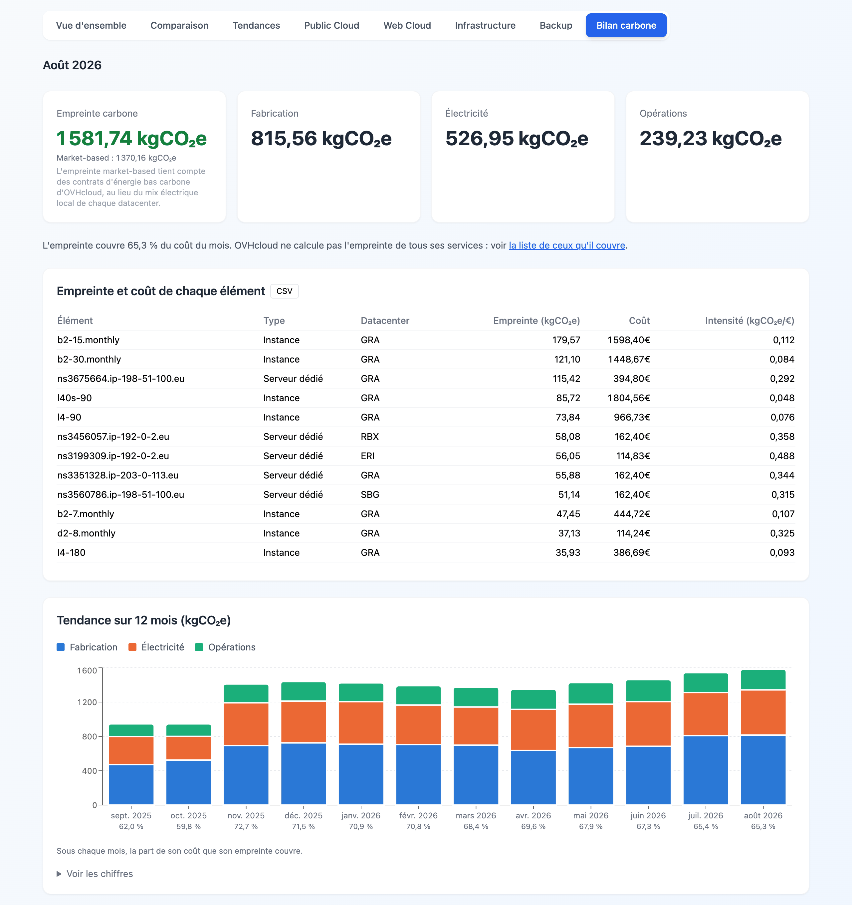

<p align="center">
  <picture>
    <source media="(prefers-color-scheme: dark)" srcset="docs/logo-dark.png">
    
  </picture>
</p>

<h1 align="center">OVH Cost Manager</h1>

<p align="center">
  <a href="https://opensource.org/licenses/MIT"></a>
  <a href="https://nodejs.org/"></a>
  <a href="https://hub.docker.com/r/mmaudet/ovh-cost-manager"></a>
  <a href="CHANGELOG.md"></a>
</p>

<p align="center">
  Interactive dashboard for OVHcloud billing analysis with cost tracking, monthly comparisons, service breakdowns, and trend analysis.
</p>

## Screenshots

The screenshots show anonymised data.

### Overview


### Month Comparison Tab


### Historical Trends


### Public Cloud


### Web Cloud


### Carbon Footprint Tab
New in version 3.1.0.



## Features

### Dashboard
- **Interactive Dashboard**: React-based SPA with Recharts visualizations
- **Multi-language Support**: French and English interface (i18n)
- **8 navigation tabs**: Overview, Comparison, Trends, Public Cloud, Web Cloud, Infrastructure, Backup, Carbon footprint
- **Several OVH Accounts**: one instance imports several accounts; a selector in the header narrows every tab down to one, and with all accounts shown, the lists name each row's account
- **Sortable Tables**: the lists sort by any of their columns with a click on its header: text from A to Z, figures, sizes and dates from the largest or the latest, and a second click reverses it

### Cost Analysis
- **Service Breakdown**: Costs by service type (Compute, Storage, Network, Database, AI/ML, Licenses, Backup, Support)
- **Resource Type Classification**: Automatic categorization (Public Cloud, Dedicated Servers, VPS, Storage, Logs Data Platform, Load Balancers, IP, Domains, Private Cloud Hosts, Private Cloud Datastores, Licenses, Backup, Telephony). Since version 3.5.0, Logs Data Platform is a resource type of its own rather than Storage, with its own row in the Overview's breakdown and in the Compare tab, its own line in the Trends tab, and its own card in the Infrastructure tab; its service type stays Database. The bills already imported show it too, without a new import: OCM reclassifies their Logs Data Platform lines as it opens its database
- **Resource Type Detail**: Expandable cost breakdown per individual service within each category
- **GPU Cost Consolidation**: Dedicated view for GPU costs by model (NVIDIA L4, L40S, A100, H100) and by project
- **AI Endpoints Models** (new in version 3.3.0): each AI Endpoints model that the month's bills name, with its input tokens, its output tokens and its cost, in the Public Cloud tab, and its monthly cost in the Trends tab (see [AI Endpoints Models](#ai-endpoints-models))
- **Logs Data Platform Charges** (new in version 3.5.0): each charge that the month's bills give the Logs Data Platform services, such as their account's rental or their streams' hot storage, with its cost, in the Infrastructure tab, and month A against month B under the Compare tab's Logs Data Platform row (see [Logs Data Platform](#logs-data-platform))
- **Month Comparison**: Side-by-side comparison between two months with variation tracking, including infrastructure, backup, Private Cloud, and per-project product breakdowns, whose rows unfold into their services and charges since version 3.3.0 (see [Month Comparison](#month-comparison))
- **Trend Analysis**: Historical trends with configurable period (3-36 months), and GPU and AI Endpoints evolution charts
- **Month in Progress** (marked since version 3.3.3, projected since 3.4.0): the month whose bills still lack a service billed every month is marked in progress rather than compared as a complete month, and a checkbox projects its cost in the Trends and Compare tabs. Since version 3.5.0, that can be the month before, until the month of today has a bill (see [Month in Progress](#month-in-progress))
- **Budget Tracking**: Visual budget consumption with configurable targets

### Real-time Monitoring
- **Current Consumption**: What the Public Cloud projects consumed this month, as OVH's Public Cloud page gives it (`--include-cloud-details`, which `--all` includes), or else the account's consumption from `/me/consumption` (`--include-consumption`)
- **End-of-month Forecast**: The forecast that OVH gives each Public Cloud project, or its consumption extrapolated to the end of the month, never below what it consumed, with a progress indicator (`--include-cloud-details`); or else the forecast of `/me/consumption`
- **Account Balance**: Debt, credits, and deposit tracking

### Infrastructure Inventory
- **Public Cloud**: Projects, each with its current consumption and what the month's bills charged it, instances (with GPU highlighting), quotas by region, Kubernetes clusters, Object Storage (S3) buckets with cost, Container Registry, and the other services (volume backups, databases, load balancers…): the cards, and what the month billed the projects, add up to the month's cloud total
- **Private Cloud / vSphere**: Hosts (ESXi), datastores (SSD), management fees
- **Dedicated Servers**: Full specs (CPU, RAM, datacenter, expiration, renewal) — Scale, Advance, Infra series
- **VPS**: Model, zone, specs, state
- **Storage**: NetApp storage services with size and number of shares
- **Backup**: Veeam Backup VMs and Enterprise licenses with cost breakdown
- **Expiring Services**: Lists the services expired or expiring within 30 days, soonest first

### Environmental Impact
- **Carbon Footprint** (new in version 3.1.0): OVHcloud's estimate of each month's carbon footprint, by emission source, location-based with the market-based footprint, next to what the same services cost (see [Carbon Footprint](#carbon-footprint))
- **Carbon Intensity**: each dedicated server, instance flavor and volume type with its footprint, its cost and its kgCO2e per unit of the currency, exportable to CSV
- **Covered Share**: the share of each month's cost that the footprint covers, as OVHcloud does not compute the footprint of all its services, with its 12-month trend

### Tools & Export
- **Export**: PDF and Markdown report generation, CSV exports (bills, details, inventory, carbon footprint)
- **CLI Tools**: Download invoices, split by project, extract bills per project
- **Data Import**: Full, differential, or targeted import from OVH API into local SQLite database

## Quick Start

```bash
# Clone and install
git clone https://github.com/mmaudet/ovh-cost-manager.git
cd ovh-cost-manager
npm install

# Configure OVH API credentials (see Configuration section below)
cp config.example.json config.json
# Edit config.json with your OVH API credentials

# Import data from OVH API
npm run import:full

# Start the dashboard
npm run dev
```

Open http://localhost:5173 to view the dashboard.

> **Note**: The import requires valid OVH API credentials. See [Configuration](#configuration) for setup instructions.

## Project Structure

```
ovh-cost-manager/
├── cli/                      # Command-line tools
│   ├── index.js              # Invoice downloader
│   ├── split-by-project.js   # Cost analyzer (via OVH API)
│   └── bills-by-project.js   # Bills extractor (via local DB)
├── data/                     # Data layer
│   ├── import.js             # OVH API → SQLite import script
│   ├── db.js                 # Database connection and queries
│   ├── classify.js           # Shared classification functions
│   ├── schema.sql            # SQLite schema
│   └── ovh-bills.db          # Local database (gitignored)
├── scripts/                  # Docker & automation scripts
│   ├── entrypoint.sh         # Docker entrypoint (server + cron)
│   └── cron-import.sh        # Periodic differential import (24h)
├── server/                   # Backend API
│   └── index.js              # Express server (port 3001)
├── dashboard/                # Frontend (Vite + React)
│   └── src/
│       ├── components/       # React components (Logo, Accordion)
│       ├── hooks/            # Custom hooks (useLanguage)
│       ├── i18n/             # Translations (FR/EN)
│       ├── pages/            # Dashboard page
│       └── services/         # API client
├── docs/                     # Documentation
│   ├── deployment.md         # Docker & SSO deployment guide
│   └── screenshots/          # Dashboard screenshots
├── Dockerfile                # Docker image definition
├── docker-compose.yml        # Base deployment (without SSO)
├── docker-compose.sso.yml    # SSO deployment (LemonLDAP-NG + OIDC)
├── .dockerignore             # Docker build exclusions
├── config.example.json       # Configuration template
└── config.accounts.example.json  # Configuration template, several accounts
```

## Prerequisites

- [Node.js](https://nodejs.org/) >= 22 for local development (24 recommended, the version of the Docker image and the CI)
- [Docker](https://www.docker.com/) and Docker Compose (for containerized deployment)
- OVH API credentials (see [Configuration](#configuration))

## Configuration

### 1. Generate OVH API Credentials

1. Go to [OVH API Token Creation](https://eu.api.ovh.com/createToken/)
2. Log in and note your **Application Key** and **Application Secret**

### 2. Generate Consumer Key

```bash
curl -X POST \
  -H "Content-type: application/json" \
  -H "X-Ovh-Application: YOUR_APP_KEY" \
  -d '{"accessRules": [
    {"method": "GET", "path": "/me"},
    {"method": "GET", "path": "/me/*"},
    {"method": "GET", "path": "/cloud"},
    {"method": "GET", "path": "/cloud/*"},
    {"method": "GET", "path": "/dedicated/server"},
    {"method": "GET", "path": "/dedicated/server/*"},
    {"method": "GET", "path": "/dedicatedCloud"},
    {"method": "GET", "path": "/dedicatedCloud/*"},
    {"method": "GET", "path": "/ip"},
    {"method": "GET", "path": "/ip/*"},
    {"method": "GET", "path": "/ipLoadbalancing"},
    {"method": "GET", "path": "/ipLoadbalancing/*"},
    {"method": "GET", "path": "/vps"},
    {"method": "GET", "path": "/vps/*"},
    {"method": "GET", "path": "/storage"},
    {"method": "GET", "path": "/storage/*"},
    {"method": "POST", "path": "/me/carbonCalculator/csv"}
  ]}' \
  https://eu.api.ovh.com/1.0/auth/credential
```

> **Minimum permissions**: `GET /me`, `/me/*` and `/cloud/*` are required. Every import reads the account it imports from `GET /me`, which `/me/*` does not cover: a key without it fails every import. The additional paths (`/dedicated/server/*`, `/dedicatedCloud/*`, `/vps/*`, `/storage/*`, `/ip/*`, `/ipLoadbalancing/*`) enable the full infrastructure inventory. The dashboard works without them but inventory data will be limited. The optional `POST /me/carbonCalculator/csv` lets the import ask OVHcloud's carbon calculator for the account's carbon footprint (`--include-carbon`, which `--all` includes): it only asks OVHcloud to generate the file: `GET /me/*` then follows its generation, and the file downloads from a link that OVHcloud gives. Without it, the import says which right the key lacks, and imports the rest. Any other failure of the footprint's import counts among the failed items, and replaces nothing.

Visit the `validationUrl` in the response to authorize the application.

### 3. Create Configuration File

Create `config.json` at project root or `$HOME/my-ovh-bills/config.json`:

```json
{
  "credentials": {
    "appKey": "YOUR_APP_KEY",
    "appSecret": "YOUR_APP_SECRET",
    "consumerKey": "YOUR_CONSUMER_KEY",
    "endpoint": "ovh-eu"
  },
  "dashboard": {
    "budget": 50000,
    "currency": "EUR",
    "language": "fr"
  }
}
```

> **Language options**: `"fr"` (French) or `"en"` (English). Can also be changed via the UI.

> **`dataDir`**: Optional. Directory where the SQLite database is stored. Defaults to `data/` within the project. Can also be set via the `DATA_DIR` environment variable (which takes precedence). The Docker Compose files set `DATA_DIR=/data`, where the `ocm-data` volume is mounted.

> **Note**: Legacy format (`credentials.json` with flat structure) is still supported.

### Several OVH Accounts

One instance can import several OVH accounts, such as one per subsidiary. List them in an `accounts` section, in place of `credentials`, as in [config.accounts.example.json](config.accounts.example.json):

```json
{
  "accounts": [
    {
      "name": "Filiale Lyon",
      "budget": 30000,
      "credentials": {
        "appKey": "LYON_APP_KEY",
        "appSecret": "LYON_APP_SECRET",
        "consumerKey": "LYON_CONSUMER_KEY",
        "endpoint": "ovh-eu"
      }
    },
    {
      "name": "Filiale Paris",
      "credentials": { ... }
    }
  ],
  "dashboard": { ... }
}
```

Each entry has:

- **`name`**, optional and unique: how the dashboard names the account, its NIC handle otherwise.
- **`budget`**, optional, a positive integer: the account's own budget, which the budget card uses when that account is selected. `dashboard.budget` stays the budget of all accounts.
- **`credentials`**, required: the account's keys, and its `endpoint`, which is required here, unlike in the `credentials` section. Request a consumer key for each account as above, and open its `validationUrl` as that account. Each key needs `GET /me`.

With several accounts:

- **One currency**: every account must bill in the currency of the first one. An account that bills in another fails its import.
- **One form**: `accounts` cannot be set with `credentials`, nor with the legacy flat form. A malformed section stops the server and the import, naming the setting. The accounts have no environment variables.
- **Import**: each import imports every account, one after the other, and a differential import starts each account from its own latest bill. An account that fails does not stop the others: the run then ends `partial`. `--account <NIC handle>` limits a run to one account (see [Import Data](#import-data)).
- **Dashboard**: it shows all accounts by default. A selector in the header narrows every tab down to one, and with all accounts shown, the lists and their CSV exports gain an Account column.
- **Upgrading**: the first import after the upgrade gives the data stored before it an account, on its own. A single account gets it all. With several, each account claims what its API lists, and an account that claimed every bill gets the rest; what no account claims shows as the Unknown account. So upgrade with the one account you had, and add the others once its first import has run: no Unknown account then shows.
- **Removed accounts**: an account removed from `config.json` keeps its data, and shows as not configured. It is no longer imported.

The [deployment guide](docs/deployment.md#several-ovh-accounts) details each point, and its [upgrade notes](docs/deployment.md#upgrading-to-several-accounts) what the first import after the upgrade does.

## Rate Limiting

The API server includes rate limiting to protect against DoS attacks and brute-force attempts. This protection is **enabled by default** but fully configurable.

### Default Limits

| Endpoint  | Limit        | Window     | Per        |
| --------- | ------------ | ---------- | ---------- |
| `/api/*`  | 1000 requests | 15 minutes | IP address |
| `/auth/*` | 20 requests  | 15 minutes | IP address |

### Configuration via config.json

Add a `rateLimit` section to your `config.json`, as in [config.example.json](config.example.json):

```json
{
  "credentials": { ... },
  "dashboard": { ... },
  "rateLimit": {
    "enabled": true,
    "trustProxy": false,
    "api": {
      "windowMs": 900000,
      "max": 1000
    },
    "auth": {
      "windowMs": 900000,
      "max": 20
    }
  }
}
```

**Parameters**:
- `enabled`: Enable/disable globally (default: `true`)
- `trustProxy`: The number of proxies in front of OCM whose `X-Forwarded-For` it trusts, from 1 to 10, `true` for one, `false` for none; with one or more, it also trusts `X-Forwarded-Host` for the CORS check and `ALLOWED_HOSTS`, and `X-Forwarded-Proto` for the CORS check (default: `false`)
- `api.windowMs`: Window duration in milliseconds (default: `900000` = 15 min)
- `api.max`: Maximum API requests per IP per window (default: `1000`). A page of the dashboard sends about 30 as it loads, and reloads what it shows once an import is over: below a few hundred, browsing the page soon blocks it
- `auth.windowMs`: Window duration for authentication endpoints (default: `900000`)
- `auth.max`: Maximum authentication requests per IP (default: `20`)

### Configuration via Environment Variables

Environment variables take **priority** over `config.json`:

```bash
# Enable/disable
RATE_LIMIT_ENABLED=true|false

# Trust proxy (CRITICAL for Kubernetes/reverse proxy): true trusts one
TRUST_PROXY=true|false|<number of proxies, 1 to 10>

# API limits
RATE_LIMIT_API_WINDOW_MS=900000    # 15 minutes
RATE_LIMIT_API_MAX=1000            # 1000 requests

# Authentication limits
RATE_LIMIT_AUTH_WINDOW_MS=900000   # 15 minutes
RATE_LIMIT_AUTH_MAX=20             # 20 requests
```

**Docker/Kubernetes Example**:
```yaml
environment:
  - TRUST_PROXY=true
  - RATE_LIMIT_API_MAX=500
  - RATE_LIMIT_AUTH_MAX=100
```

### Disabling Rate Limiting

For internal applications secured by upstream SSO:

```bash
# Via environment variable
RATE_LIMIT_ENABLED=false

# Or in config.json
{
  "rateLimit": {
    "enabled": false
  }
}
```

### ⚠️ IMPORTANT: Kubernetes / Reverse Proxy Deployments

**Problem**: By default, the server identifies clients by their IP address. Behind a reverse proxy (Kubernetes Ingress, Traefik, nginx), **all requests** appear to come from the same IP (the proxy/ingress IP). Result: all users share the same global limit.

**Symptoms**:
- 429 "Too many requests" errors after only a few dozen requests
- Multiple users are blocked simultaneously
- The problem is amplified if users connect through a corporate VPN (single IP)

**Required Solution**:

You **must** enable `trustProxy` so the server uses the `X-Forwarded-For` header:

```bash
# Via environment variable (recommended)
TRUST_PROXY=true

# Or in config.json
{
  "rateLimit": {
    "trustProxy": true
  }
}
```

Once enabled, each user is identified by their real IP address and gets their own individual limit. Behind several proxies, set their number instead, counted as the [deployment guide](docs/deployment.md#rate-limiting-for-kubernetesreverse-proxy) says.

**Alternative**: If your application is 100% internal and protected by SSO, you can completely disable rate limiting (`RATE_LIMIT_ENABLED=false`).

> **Note**: Standard `RateLimit-*` headers are included in responses to indicate remaining limits. Check `RateLimit-Limit`, `RateLimit-Remaining`, and `RateLimit-Reset` headers.

## Usage

### Import Data

```bash
# Full import (all historical data)
npm run import:full

# Import specific period
npm run import -- --from 2025-01-01 --to 2025-12-31

# Differential import (new data since last import)
npm run import:diff

# Include the account's /me/consumption and its history, which the consumption and forecast
# cards read when no Public Cloud project consumed in the month
npm run import -- --from 2025-01-01 --include-consumption

# Include infrastructure inventory (servers, VPS, storage)
npm run import -- --from 2025-01-01 --include-inventory

# Include cloud project details: each project's consumption and month-end forecast, which the
# consumption and forecast cards read, its instances and its quotas
npm run import -- --from 2025-01-01 --include-cloud-details

# Include the carbon footprint of the last 24 months, which OVHcloud's carbon calculator gives
npm run import -- --diff --include-carbon

# Import everything
npm run import -- --from 2025-01-01 --all

# Several accounts: import one account alone, by its NIC handle
npm run import -- --diff --all --account xx1111-ovh

# Several accounts: clear and reimport one account alone
npm run import -- --full --all --account xx1111-ovh
```

With several accounts, each run imports every account, one after the other, under one entry of the import history. An account that fails does not stop the others: the run then ends `partial`, and names it, or `failed` when every account did. The import's output names each account's NIC handle. `--full` clears each account that it can import, and keeps the data of the others (see the [deployment guide](docs/deployment.md#importing-several-accounts)). Give it `--all`: it clears the account's inventory, balance, consumption history and credit movements too, and fetches again only the datasets that its flags ask for.

### Start Dashboard

```bash
# Development (server + frontend)
npm run dev

# Or separately:
npm run dev:server    # Backend on :3001
npm run dev:dashboard # Frontend on :5173
```

### CLI Tools

```bash
# Download invoices
npm run cli -- --from=2025-01-01 --to=2025-12-31

# Generate markdown summary
npm run cli -- --from=2025-01-01 --summary

# Split by project via OVH API (JSON)
npm run split -- --from 2025-12-01 --to 2025-12-31

# Split by project via OVH API (Markdown)
npm run split -- --from 2025-12-01 --to 2025-12-31 --format md

# Extract bills from local DB
npm run bills -- --list                              # List all projects
npm run bills -- --project "AI"                      # All bills for project
npm run bills -- --project "AI" --from 2025-01-01 --to 2025-12-31
npm run bills -- --project "AI" --format md          # Markdown output
npm run bills -- --month 2025-12                     # All bills for a month
npm run bills -- --month 2025-12 --format md         # Markdown output
```

## Carbon Footprint

Since version 3.1.0, OCM imports the carbon footprint that OVHcloud's carbon calculator attributes to each account's services, and shows it in the Carbon footprint tab next to what those services cost.

### What the Figures Are

- **Estimates**: OVHcloud models them from its emission factors and from the services that each account used, rather than measuring them. OCM shows them as OVHcloud gives them, and computes none of its own.
- **Unit**: kgCO2e, kilograms of CO2 equivalent. OVHcloud gives no energy figure, in kWh, so OCM shows none.
- **Emission sources**: the manufacturing of the servers, the electricity that they draw, and the operations (freight, buildings, staff…).
- **Location-based**: the footprint of the electricity follows each datacenter's local electricity mix. Next to it, the market-based footprint counts OVHcloud's low-carbon energy contracts instead.
- **Monthly**: OVHcloud gives a month's footprint once the month is over, so the current month never has one.

### What OVHcloud Covers

OVHcloud does not compute the footprint of all its services: its [guide](https://docs.ovhcloud.com/en/guides/account-and-service-management/managing-billing-payments-and-services/carbon-footprint) lists those that it covers, such as dedicated servers, Public Cloud instances and their Block Storage volumes. The Carbon footprint tab says what share of each month's cost the footprint covers (see [What the Carbon Footprint Tab Shows](#what-the-carbon-footprint-tab-shows)).

### The Months OCM Keeps

OVHcloud's carbon calculator gives the last 24 months. Each import that includes the footprint asks for those 24 months again, and replaces them. OCM keeps the older months, which OVHcloud no longer gives, even with `--full` ([ADR 0003](docs/adr/0003-a-full-import-keeps-the-carbon-footprints-ovhcloud-no-longer-gives.md)).

### How to Enable It

1. Give each account a consumer key with the rule `POST /me/carbonCalculator/csv`: request one with the command of [Generate Consumer Key](#2-generate-consumer-key), which lists the rule and says what an import does without it, and replace the old key in `config.json`.
2. Import with `--include-carbon`, which `--all` includes: `npm run import -- --diff --include-carbon`. The Docker containers import with `--all` by default (`IMPORT_FLAGS`).

### What the Carbon Footprint Tab Shows

The tab follows the month and the account selected in the header:

- **Footprint**: the month's, by emission source, with its market-based footprint. A month without one, such as the current month, shows the latest month that has one, and says so.
- **Covered share**: what the services that the footprint covers cost, as a share of what all the services cost that month, both before their credits and discounts. A month's footprint counts the services used that month, so both are costs of its month of use: for a Public Cloud project, the bill lines of the next month's bills, as OVHcloud bills Public Cloud after use; for the other services, those of the month's bills.
- **Items**: each dedicated server, instance flavor and volume type of the footprint, per datacenter, the largest first, with what its bill lines cost in the month of use and its carbon intensity, in kgCO2e per unit of the currency. Before July 2026, OVHcloud's file names no dedicated server: one item per account then gathers them, next to what all its dedicated servers cost. The CSV button exports the list.
- **Trend**: the footprint of the 12 months up to that month, by emission source, with each month's covered share under it, as a step in the footprint may come from OVHcloud covering a new service rather than from an increase.

With all accounts shown, the footprint adds up the accounts that have one, and names the others. What the others cost counts in the covered share as not covered, and so does what the Unknown account costs: it never has a footprint, which is imported account by account. OVHcloud's file gives no footprint per Public Cloud project.

## AI Endpoints Models

OVHcloud's AI Endpoints serves AI models through an API, and bills each model's use on the bill lines of the Public Cloud project that called it, one per charge: most often the model's input tokens and its output tokens, priced apart, such as « Nombre de tokens d'entrée pour le modèle AI Endpoints gpt-oss-20b », or "Amount of input tokens for AI Endpoints gpt-oss-20b model" on English bills, whose quantity is the number of tokens. Since version 3.3.0, OCM reads the model that each line names, and what the line counts, when the server reads the bills: the bills already imported show them, without a new import.

Both tabs follow the account selected in the header, and add up the accounts' lines when all are shown.

### What the Public Cloud Tab Shows

Between the cards and the list of projects, the **AI Endpoints by model** table lists the models that the month's bills name, the bills that the cards count, one row per model, the projects together:

- **Model**: as the bills name it, such as `gpt-oss-20b`.
- **Input tokens** and **output tokens**: in millions, such as 12.5 M, and to two significant digits below 0.1 M, so that a model in use never reads 0. A model whose lines count no such tokens shows « — » rather than 0: an embedding model counts its input tokens alone, so its output tokens show « — », and a speech-to-text model is billed by the second of audio, so both its token columns do.
- **Cost**: all the model's lines together, those that count no tokens included. A model that the bills charge nothing for, such as a free one, shows its tokens and a cost of 0.

The table sorts by cost, the most expensive first, until a header is clicked, and its last row gives the month's AI Endpoints cost. It shows only for a month whose bills name an AI Endpoints model. AI Notebooks, AI Training and AI Deploy name no model: they stay in the AI product of the other services, which may therefore cost more than the table's total.

### What the Trends Tab Shows

The **AI Endpoints cost evolution by model** chart gives each model's cost month by month, over the tab's period up to the month selected in the header: a stacked bar per month of the bills, one color per model, with a legend of the models, the most expensive over the period first, and a tooltip that gives each model's cost in the month. A model keeps its color from one period or account to the next, though two models may share one. As the GPU chart, it shows once two months of the period have AI Endpoints lines.

## Logs Data Platform

OVHcloud bills each Logs Data Platform service, `ldp-` and a code, under its « DBAAS-LOGS » heading, on a line per charge: the rental of its account, « Logs - Account rental for 1 month », the hot storage of its streams, in three tiers, a free one among them, their cold storage, its input instances and its hosted OpenSearch Dashboards instances. Since version 3.5.0, Logs Data Platform is a resource type of its own, and OCM reads the charge of each of its lines when the server reads the bills: the bills already imported show them, without a new import.

The account rental covers the month of its bill, while the other charges, what the service consumed, cover the month before. OCM counts them all by the month of their bill, as it counts the lines of the Public Cloud projects, which also cover the month before: a month shows its own rental, and what the services consumed the month before.

### What the Infrastructure Tab Shows

Under the costs by resource type, the **Logs Data Platform by charge** table lists the charges that the bills of the month selected in the header give the Logs Data Platform services, one row per charge, the services together:

- **Charge**: as the bills name it, in their wording whatever the page's language, without the period that ends it on some accounts' bills, such as « (01/08/2026-31/08/2026) », so that a charge reads alike from one month to the next.
- **Cost**: what its lines cost in the month, every service's together.

The table sorts by cost, the most expensive first, until a header is clicked, and its last row gives what the charges cost in all: the month's Logs Data Platform cost, which its card gives too. A charge that costs nothing, such as the free tier of the hot storage, is left out, as a product's are in the Compare tab, while a charge that a refund brings below 0 € shows, with its negative amount, so that the charges add up to that cost. The table shows only for a month with a charge, a refund alone included. It follows the account selected in the header, and adds up the accounts' charges when all are shown, without an Account column. It shows what the month billed, never its projected cost, and prints with the page; it has no CSV export, as the export of the bill lines holds every line.

### What the Compare Tab Shows

The infrastructure comparison gives Logs Data Platform a row of its own, with its cost in months A and B and the variation. Where the other resource types unfold into their services, it unfolds into its charges, the services together, as a project's products unfold into theirs (see [Rows That Unfold](#rows-that-unfold)):

- **Charges**: those that the Infrastructure tab's table lists for each month, as the bills name them, paired by charge, so that a charge billed in both months makes one row.
- **Amounts**: what each charge cost in month A and in month B, 0 € in a month that did not bill it. They add up to the row's amounts, a charge that a refund brings below 0 € included, and the row unfolds as soon as either month's cost is other than 0 €, a refund alone included.
- **Variation**: from month A to month B, as for the other rows: « — » from 0 € or less in month A, and −100 % to a month B that did not bill the charge.

The charges load once the row unfolds, for the account selected in the header, every account's added up when all are shown, and share each month's answer with the Infrastructure tab's table. They follow the table's sort within the row, by month A, the most expensive first, until the user sorts it. While « Projeter le mois en cours » is ticked and month A or B is the month in progress, they count its projected cost, as the row does: a charge whose amount includes a projected part, or that only the projection brings, such as the hot storage of a service whose bill has not come yet, is in italics and marked « projeté », with a tooltip that gives what was billed and the projected cost, and the variations are computed on the projected cost (see [Projecting Its Cost](#projecting-its-cost)). The Infrastructure tab's table still shows what the month billed.

## Month Comparison

The Compare tab compares two months, month A and month B, from their bills: it opens on the two latest months that have bills, and the user picks others. It compares their totals, their costs by service type and by project, their costs by resource type in the infrastructure and Private Cloud comparisons, their Veeam backups, and each Public Cloud project's products. Each row gives the amount of month A, the amount of month B and the variation from one to the other, in red when it grows and in green when it shrinks. The tab follows the account selected in the header.

### Rows That Unfold

Since version 3.3.0, each row that adds up several services or charges unfolds into them, month A against month B, one row each, in the columns of the row it details:

- **Infrastructure and Private Cloud comparisons**: each resource type (dedicated servers, VPS, storage, load balancers, IP addresses, domains, Private Cloud hosts and datastores) unfolds into its services, named as the Infrastructure tab names them: by their identifier and the description of their most expensive bill line, month B's when month B billed them, cut to its column, whole on hover. The Dedicated Servers row no longer lists the servers that the inventory holds today, which have nothing to do with months A and B: it unfolds into the servers that either month billed, and the Infrastructure tab keeps listing the inventory.
- **Logs Data Platform**: since version 3.5.0, its row of the infrastructure comparison unfolds into its charges rather than its services, the services together, as the Infrastructure tab lists them (see [Logs Data Platform](#logs-data-platform)).
- **Backup comparison**: the row of the Veeam VMs unfolds into each VM backed up, and that of the Enterprise licenses into each license. Folded, each keeps its number of services and its amount, and it unfolds into as many services, but in three cases: a VM that a refund brings to 0 € or less is counted, but not listed; a line without an identifier is listed, but not counted; and, while the lists name each row's account, a VM that two accounts billed is counted once, but listed once for each account.
- **A project's comparison**: each product unfolds into its charges. The Public Cloud credit that the bills used pays for no product, and does not unfold.

Every row starts folded. A chevron at the start of a row unfolds it and folds it again, from the keyboard too; a row that neither month billed has none. A row stays unfolded when the table is sorted, when the user picks other months, whose services or charges it then shows, and when another tab is opened. A row's services, or the Logs Data Platform row's charges, load once it unfolds: it says so until both months have answered, or that a month's could not load. A resource type's services of a month, and the Logs Data Platform charges, load once for this tab and the Infrastructure tab, for the same account. A product's charges come with the products, so that it unfolds at once. The PDF export prints the unfolded rows, without their chevrons.

The service type chart and the comparison by project do not unfold.

### Services and Charges

The words are those of the [glossary](CONTEXT.md):

- **Service**: what OVHcloud bills under one identifier, which each of its bill lines names: a dedicated server, a VPS, a domain, an IP block, a Public Cloud project… Its identifier gives its resource type.
- **Charge**: what a service's bill line pays for, as its description names it without the period it covers: an instance's monthly plan, named with the instance's id and region, a flavor's hourly use in a region, a bucket's storage, an AI Endpoints model's input tokens… A Public Cloud project is a single service, whose bill lines differ by what they pay for: its products unfold into their charges. The row of Logs Data Platform unfolds into the charges of its services' lines too, the services together: their account's rental, their streams' storage, their input instances…

On some accounts' bills, the Public Cloud descriptions end with the period that the line covers, such as « (01/08/2026-31/08/2026) »; on others, they carry none. A charge leaves that period out, and writes a curly apostrophe straight, so that the lines that pay for one charge in two months, or on two accounts' bills, make one row. The lines of one charge in a month add up, and a product's charges add up to its amount; the charges that cost nothing in a month are left out, as the products that cost nothing are. OCM reads the charges when the server reads the bills, as it reads the products: the bills already imported show them, without a new import.

### Billed in One Month

A service or charge that one of the months did not bill shows 0 € in that month:

- **Month B only**: its variation reads « — », which cannot be computed from 0 €, with a tooltip that says why, as for a project billed in month B only.
- **Month A only**: its variation reads −100 %.

The services of a row add up to its amounts, but for a service whose lines of a month add up to 0 € or less, such as one that a refund cancels out: it shows 0 € in that month, as the Infrastructure tab leaves such a service out.

### Order

The services and charges of a row follow the table's sort, within their row, by the same columns: their identifier or their charge, month A, month B or the variation, and each stays under its own row. Until the user sorts the table, they come by month A, the most expensive first, then by month B. The Private Cloud and backup comparisons, which do not sort, keep that order.

### Several Accounts

The services and charges are those of the account selected in the header, and, for the Unknown account, those of the bills without an account. With all accounts shown, a project's products and their charges, and the Logs Data Platform charges, add up the bills of every account. When the instance holds several accounts, the lists then name each row's account: each service names its own in brackets, by its name, or else its NIC handle, and the Unknown account as such. A service that two accounts billed shows once for each, so that its rows add up to the row's amounts.

## Month in Progress

OVHcloud bills some accounts early in the month and others late, and some bills of a month land once the next one has begun. So the bills of the latest month may still lack some of the services billed every month: its cost so far is below what the month will cost, and comparing it with a complete month would show a drop that is not one. Since version 3.3.3, OCM tells that month apart; since version 3.4.0, it can project its cost; since version 3.5.0, that month can be the month before, until the month of today has a bill.

The words are those of the [glossary](CONTEXT.md):

- **Recurring service**: a service of a month that the bills of each of the three months before it charged.
- **Month in progress**: the latest month with bills, while it has not billed each of its recurring services yet: the month of today, as the server's clock gives it, or, until the month of today has a bill, the month before (see [The Turn of the Month](#the-turn-of-the-month)). Once the import brings the last late bill, the month is complete, however early it is. A month of today without any bill yet is not listed.
- **Projected cost**: the cost of the month in progress with each recurring service that it has not billed yet counted at its cost of the month before, assuming it stays the same.

OCM tells them when the server reads the bills: the bills already imported show them, without a new import. A yearly renewal or a one-off purchase is not a recurring service, and keeps no month in progress.

The month of today is that of the server's clock, in its time zone. The Docker image runs in UTC unless `TZ` is set, and the compose files set it to `Europe/Paris` by default: `TZ=America/Montreal` in `.env`, for instance, sets another. A Kubernetes deployment sets `TZ` in its environment.

### The Turn of the Month

On the first days of a month, before its first bill, the month of today has no bill, and OCM does not list it yet. The month before may still lack the bills that land once the month has begun: until the month of today has a bill, the month before is the month in progress while it lacks one of its recurring services, those that the bills of each of the three months before it charged. The page marks and projects it as it would the month of today: on October 1st, before any October bill, September is « en cours » while it lacks a recurring service, dashed in the Trends tab, its variations « — », and projected when the checkbox is ticked.

As soon as the month of today has a bill, it takes over: it is the month in progress while it lacks a recurring service, and the month before shows as complete, even if it still lacks a late bill. One month only is ever in progress, the latest month listed. An account billed early in the month sees no change: its month before is complete when the month of today begins, so no month is in progress until the month of today has a bill. An account without a bill in either month, such as one removed from the configuration or whose imports stalled, has no month in progress: the month in progress always has bills.

The limit: OCM cannot tell a late bill from a service that was cancelled. A recurring service that was cancelled keeps the month in progress, at most until the month ends or, for the month before, until the month of today has a bill or ends. The next month no longer counts it among its recurring services, as the month before it did not bill it.

### How the Page Marks It

- **Header**: the « Coût total du mois » card says « en cours », and its variation against the month before reads « — », with a tooltip that says why. The header's month selector shows no mark, for the room it would take.
- **Compare tab**: the month selectors name it « Septembre 2026 (en cours) », and every variation that involves it reads « — »: in the totals, in the tables, and in the services and charges they unfold into.
- **Trends tab**: both line charts draw the segment to it dashed, with a hollow point, and their tooltip gives what it billed so far. The growth over the period and the annual projection read « — », marked « mois en cours ».
- **Markdown report**: it names the month « (en cours) ».

### Projecting Its Cost

The « Projeter le mois en cours » checkbox ("Project the month in progress") projects it. It sits next to the Trends tab's period and next to the Compare tab's months, and it is one setting for the whole page, off by default, which the browser remembers. While it is ticked:

- **Trends tab**: both line charts end on the projected cost, still dashed, and their tooltip gives what the month billed and its projected cost. The growth and the annual projection are computed on it, and the most expensive month, when it is the month in progress, reads « projeté ».
- **Compare tab**: the month in progress counts at its projected cost everywhere:
  - in the totals, the service type chart, and the infrastructure, Private Cloud and backup comparisons;
  - in the comparison by project and each project's products;
  - in the services and charges they unfold into.

  An amount that includes a projected part is in italics and marked « projeté », with a tooltip that gives what was billed and the projected cost; in the chart, the projected part is stacked on the billed bar, lighter and dashed. A service, product or charge that only the projection brings is marked « projeté ». The variations are computed on the projected cost.
- **Everywhere else**: the header's cards, the Overview and the other tabs show what was billed, whatever the setting.

A service not billed yet counts as its bill lines of the month before, with their resource type, service type, project, product and charge: it shows where it showed then. So does a Public Cloud project's credit, with the rest of its project's lines, when the month has not billed that project yet. In the chart, a projected credit lowers its service type's bar rather than add a segment to it: the bar's height is always the month's projected cost.

### Several Accounts

Each account's recurring services are its own, and so is its month of today, which begins with its own first bill. The Unknown account's bills stopped with the accounts, as every bill imported since has its account: it has a month in progress only while its last month is the month before and lacks a recurring service. With all accounts shown, the month of today begins as soon as any account has a bill in it, as the months list then lists it; the month is in progress while any account lacks one of its recurring services in it, and the projection adds up what each account lacks in it. A service that another account billed this month, such as one moved from an account to another, is not missing.

## Docker Deployment

Two deployment modes are available. The [deployment guide](docs/deployment.md) describes both, with every setting, and is the reference for them:
- **Simple** (`docker-compose.yml`): OCM only, direct access on port 3001
- **SSO** (`docker-compose.sso.yml`, used on its own): OCM behind LemonLDAP-NG, its OpenID Connect (OIDC) provider and reverse proxy

### Option 1: Simple Deployment (without SSO)

```bash
# Build and start
docker-compose up -d --build

# View logs
docker-compose logs -f ocm
```

Access the dashboard at http://localhost:3001

> **Automatic import**: at start, the container runs a full import when its database holds no bill, then a differential import every 24 hours. Configure them with `IMPORT_INTERVAL` and `IMPORT_FLAGS`. `IMPORT_ENABLED=false` turns them off, and the dashboard's resync button with them (see the [deployment guide](docs/deployment.md#3-import-billing-data)).

The container's settings, such as `ALLOWED_HOSTS` against DNS rebinding, `TRUST_PROXY` behind a reverse proxy, or OIDC sign-in, are listed in the [deployment guide](docs/deployment.md#environment-variables).

### Option 2: SSO Deployment (with LemonLDAP-NG)

```bash
# Build and start the stack (the file is used on its own)
docker-compose -f docker-compose.sso.yml up -d --build

# View logs
docker-compose -f docker-compose.sso.yml logs -f
```

LemonLDAP-NG is the OIDC provider and the only way in to OCM: open http://ocm.localhost and sign in with one of the demo accounts that [demo/README.md](demo/README.md#before-any-real-use) lists. The [deployment guide](docs/deployment.md#sso-deployment-with-lemonldap-ng) covers another domain, and what to replace before any real use.

### Volume Mounts

| Volume               | Purpose                   | Mode     |
| -------------------- | ------------------------- | -------- |
| `ocm-data`           | SQLite database (`/data`) | Both     |
| `lemonldap-conf`     | LemonLDAP configuration   | SSO only |
| `lemonldap-sessions` | SSO session storage       | SSO only |

> **Upgrading from 2.2.0 or earlier**: `ocm-data` used to be mounted on `/app/data`, where the image also ships the data-layer code. Docker copied that code into the volume on first start, so later image updates never reached it. Both compose files now mount the volume on `/data` and set `DATA_DIR=/data`: the existing volume and its database are picked up as is, just recreate the container as for any update. If you run the image with `docker run` or your own compose file, make the same change.
>
> Bill lines are classified at import time, so classification fixes only apply to bills imported afterwards. To reclassify past bills, re-import a period: `docker exec ovh-cost-manager node /app/data/import.js --from 2025-01-01 --all`. A `--diff` import skips bills already in the database, and `--full` clears it first. Logs Data Platform's resource type, new in version 3.5.0, needs no re-import: OCM gives it to the bills already imported as it opens its database, when the container starts.

### Production Deployment

Before going to production, go through the [production checklist](docs/deployment.md#production-checklist) of the deployment guide: HTTPS, secrets, the demo's key pair and accounts, the reverse proxy settings, and backups.

## API Endpoints

For an instance of [several accounts](#several-ovh-accounts), every route that lists or adds up data takes an optional `account` parameter, `/api/bills`, `/api/analysis/daily-trend` and the five [CSV exports](#csv-exports) included:

- the NIC handle of an account that `GET /api/accounts` lists, such as `?account=xx1111-ovh`;
- `unknown`, for the Unknown account: the data stored before the upgrade that no account claimed;
- none, for all accounts, as before.

Any other value gets a 400. The routes of one bill or one project, such as `/api/bills/:id` or `/api/projects/:id/instances`, need no parameter, as that bill or project belongs to one account. `/api/projects/:id/products` takes it all the same, as it breaks down what `/api/analysis/by-project` gives the project for an account: a project's bill lines belong to the account of their bill, which may not be the project's own, as for a project moved to another account. Without the parameter, the account-wide figures (the month's consumption, its forecast, the balance and the consumption history) add up the accounts. The rows that belong to an account, such as projects, services and credit movements, name it in an `account` field: its NIC handle, or `null` for the Unknown account. With several accounts, the CSV exports gain a last `account` column. `byAccount=true` on `/api/analysis/by-project`, `/api/analysis/resource-type-details`, `/api/analysis/backup-services` and `/api/gpu/summary` gives a project or a service billed to several accounts once for each account, with its account.

### Accounts

| Endpoint            | Description                                                                                                        |
| ------------------- | ------------------------------------------------------------------------------------------------------------------ |
| `GET /api/accounts` | The accounts: `id`, `nic`, `name`, `currency`, `configured`, `unknown`, `lastImport`, `lastSuccessAt` and `budget` |

The route lists the accounts that the imports recorded: those that the configuration of the last import listed, in its order, then the others, then the Unknown account while it holds data. `id` is the value of the `account` parameter: the NIC handle, `nic`, or `unknown` for the Unknown account, whose `nic`, `name` and `currency` are `null`. `name` is the configured name, as the account's last import recorded it, or else the NIC handle; `configured`, whether the configuration of the last import listed the account; `unknown`, whether it is the Unknown account. `lastImport` gives when the account's last import ended, with its `status` and `error`, or `null` until one has; `lastSuccessAt`, when its last successful import ended. `budget` is the account's own budget, or `null`. An empty database lists no account, and a database not imported since the upgrade the Unknown account alone.

### Billing & Analysis

| Endpoint                                                  | Description                                   |
| --------------------------------------------------------- | --------------------------------------------- |
| `GET /api/months`                                         | Available months; the month in progress has `inProgress: true` |
| `GET /api/summary?from=&to=`                              | Summary with totals                           |
| `GET /api/bills?from=&to=&account=`                       | List bills in date range                      |
| `GET /api/analysis/by-project?from=&to=`                  | Costs grouped by project                      |
| `GET /api/analysis/by-service?from=&to=`                  | Costs grouped by service type                 |
| `GET /api/analysis/by-resource-type?from=&to=`            | Costs grouped by resource type                |
| `GET /api/analysis/resource-type-details?type=&from=&to=` | Detail for a specific resource type           |
| `GET /api/analysis/public-cloud-stats?from=&to=`          | Public Cloud cards, `other` included          |
| `GET /api/analysis/ai-endpoints?from=&to=`                | Cost and tokens of each AI Endpoints model    |
| `GET /api/analysis/logs-data-platform?from=&to=`          | Cost of each Logs Data Platform charge        |
| `GET /api/analysis/backup-stats?from=&to=`                | Backup stats (Veeam VMs, Enterprise licenses) |
| `GET /api/analysis/backup-services?from=&to=`             | Each Veeam VM and Enterprise license          |
| `GET /api/analysis/daily-trend?from=&to=&account=`        | Daily cost trend                              |
| `GET /api/analysis/monthly-trend?months=6&end=YYYY-MM`    | Monthly cost trend, `months` ending on `end`  |

The monthly trend covers `months` calendar months, from 1 to 240, 6 by
default, that end on the `end` month, that one included: `?months=3&end=2026-09`
covers July to September 2026. Without `end`, it ends on the month of the
latest bill. It gives each of those months, at 0 for a month without any bill,
or none when none of them has a bill.

`projected=true` asks for the projected cost of the month in progress (see
[Month in Progress](#month-in-progress)). These routes take it:

- the monthly trends: `/api/analysis/monthly-trend` and
  `/api/analysis/monthly-trend-by-category`;
- the totals and costs: `/api/summary`, `/api/analysis/by-service`,
  `/api/analysis/by-resource-type` and `/api/analysis/by-project`;
- the services: `/api/analysis/resource-type-details`,
  `/api/analysis/backup-stats` and `/api/analysis/backup-services`;
- a project's products: `/api/projects/:id/products`;
- the Logs Data Platform charges: `/api/analysis/logs-data-platform`.

When their period covers the month in progress, they count its projected cost,
and each row gives its projected part as `projected`, 0 when it has none: a
project, a product, a charge… A row that only the projection brings is listed
too. `/api/projects/:id/products` gives the projected part of the credit as
`projectedCredits`, next to `credits`. Without the parameter, or with
`projected=false`, they answer as before; any other value gets a 400.

`/api/analysis/ai-endpoints` gives the AI Endpoints models that the bills of
the period name, the projects together, which the Public Cloud and Trends tabs
show (see [AI Endpoints Models](#ai-endpoints-models)): `total`, what they cost
in all, and `models`, each with its `model`, as the bills name it, its
`inputTokens` and `outputTokens`, `null` when none of its lines counts those
tokens, and its `total`, the most expensive first. `monthlyTrend` gives each
`month`, `YYYY-MM`, of the period whose bills name a model, by the month of its
bills, the earliest first, with the `costs` of every model of the period in it,
at 0 for a model that the month did not bill. Amounts are to the cent.

`/api/analysis/logs-data-platform` gives the charges that the bills of the
period give the Logs Data Platform services, the services together, which the
Infrastructure tab shows, and the Compare tab's Logs Data Platform row unfolds
into (see [Logs Data Platform](#logs-data-platform)):
`total`, what they cost in all, and `charges`, each with its `charge`, as the
bills name it without its period, and its `total`, the most expensive first.
A charge that costs nothing is left out, one that a refund brings below 0 is
kept, and a period without any gives an empty list. Each line counts in the month of its bill. Amounts are to
the cent. With `projected=true`, the total and each charge give their projected
parts as `projected`, which add up as their amounts do, and they add up to the
`logs_data_platform` row of `/api/analysis/by-resource-type` with the same
parameters.

`/api/analysis/backup-services` gives the services of the Veeam backups that
the bills of the period charged, which the Compare tab's backup comparison
unfolds its rows into (see [Month Comparison](#month-comparison)): `vms`, each
VM backed up, and `enterprise`, each Enterprise license, the services of the
very bill lines that `/api/analysis/backup-stats` counts. Each gives its
`domain`, the service's identifier, the `description` of its most expensive
bill line, its `total` and its `line_count`, as
`/api/analysis/resource-type-details` gives a resource type's services: those
whose lines add up to more than 0 €, the most expensive first.

### Consumption & Account

| Endpoint                                       | Description                     |
| ---------------------------------------------- | ------------------------------- |
| `GET /api/consumption/current`                 | Current consumption (real-time) |
| `GET /api/consumption/forecast`                | End-of-month forecast           |
| `GET /api/consumption/usage-history?from=&to=` | Consumption history             |
| `GET /api/account/balance`                     | Debt, credits, deposits         |
| `GET /api/account/credits`                     | Credit movements                |

### Carbon Footprint

| Endpoint                                  | Description                                                                                                                                                  |
| ----------------------------------------- | ------------------------------------------------------------------------------------------------------------------------------------------------------------ |
| `GET /api/carbon/footprint?month=YYYY-MM` | A month's carbon footprint, location-based, by emission source and in total, in kg CO2eq, its market-based total, the latest month that has one, and the accounts without one |
| `GET /api/carbon/trend?end=YYYY-MM`       | The carbon footprint of the 12 months that end on `end`, location-based, by emission source and in total, with its covered share, `null` for a month without one |
| `GET /api/carbon/by-server?month=YYYY-MM` | Each line of a month's carbon footprint, with what its bill lines cost in the month of use and its intensity, and the covered cost with its covered share |

The carbon footprint is what OVHcloud's carbon calculator attributes to the accounts' services: `footprint` gives its `manufacturing`, `electricity`, `operations` and `total`, location-based, and its `marketBasedTotal`, which counts OVHcloud's low-carbon energy contracts instead of the local electricity mix; it is `null` for a month without one, such as the current month. `latestMonth` is the latest month that has one, or `null` when none has. Without the `account` parameter, `accountsWithoutFootprint` names the accounts without a footprint that month, which the sum leaves out: the configured ones, in the configuration's order, then those no longer configured that were billed that month. It is `null` with the parameter.

`/api/carbon/by-server` gives the `lines` of a month: each dedicated server (by its `serverDomain`), instance flavor (`name`, with `.monthly` for a monthly plan) and volume type that OVHcloud's file names, per `datacenter`, and, before July 2026, when the file names no server, one line for the dedicated servers with their number in `unnamedServers`. Each gives its `footprint` in kg CO2eq, its `cost`, what the bill lines that tie to it cost in the month of use (see [What the Carbon Footprint Tab Shows](#what-the-carbon-footprint-tab-shows)), `null` when none does, and its `intensity`, the footprint per unit of the currency. `coveredCost` is what the bill lines that tie to the lines cost, the dedicated servers that the file does not name included, and `coveredShare` its share of what all the bill lines of the month of use cost, those of the accounts without a footprint included, as OVHcloud does not compute the footprint of all its services. Both count the bill lines before their credits and discounts, the lines of a negative price, as a credit pays for no service in particular. `coveredShare` is `null` without a footprint, or when the month of use costs nothing. Each month of `/api/carbon/trend` gives its `coveredShare`, `null` without a footprint, so that a step due to OVHcloud covering a new service is not taken for an increase.

### Inventory

| Endpoint                                         | Description                                  |
| ------------------------------------------------ | -------------------------------------------- |
| `GET /api/projects`                              | List all Cloud projects                      |
| `GET /api/projects/enriched`                     | Projects with instance count and consumption |
| `GET /api/projects/:id/consumption?from=&to=`    | Project consumption by resource              |
| `GET /api/projects/:id/instances`                | Project instances                            |
| `GET /api/projects/:id/quotas`                   | Project quotas by region                     |
| `GET /api/projects/:id/buckets?from=&to=`        | Project S3 buckets with cost                 |
| `GET /api/projects/:id/other-services?from=&to=` | Project's other services, registry included |
| `GET /api/projects/:id/products?from=&to=`       | Project's products and their charges         |
| `GET /api/projects/:id/instance-total?from=&to=` | Project instance total cost                  |
| `GET /api/inventory/servers`                     | Dedicated servers list                       |
| `GET /api/inventory/vps`                         | VPS instances list                           |
| `GET /api/inventory/storage`                     | Storage services list                        |
| `GET /api/inventory/summary`                     | Resource count summary                       |
| `GET /api/inventory/expiring?days=30`            | Expired and expiring services, soonest first |

`/api/projects/:id/products` gives what the bills of the period charged a
project, which the Compare tab compares month by month (see
[Month Comparison](#month-comparison)): its `products`, each with its
`product`, its `total` and its `charges`, what its bill lines add up to by
charge, each as `{ charge, total }`, the most expensive first, and `total`,
what the products cost in all; and `credits`, the Public Cloud credit that the
bills used, which pays for no product and has no charges. The products and
charges that cost nothing are left out. Amounts are to the cent.

### GPU & System

| Endpoint                         | Description                        |
| -------------------------------- | ---------------------------------- |
| `GET /api/gpu/summary?from=&to=` | GPU costs by model, project, trend |
| `GET /api/import/status`         | Import history and status          |
| `GET /api/config`                | Dashboard configuration, version   |
| `GET /api/user`                  | Current authenticated user info    |
| `GET /api/health`                | Health check endpoint              |

`/api/config` also gives the `version` of OCM that the server runs, which the
dashboard's footer shows, linked to its release notes. It is behind
authentication, as the rest of the API: `/api/health`, which answers without
it, does not give the version.

### CSV Exports

| Endpoint                               | Description                                 |
| -------------------------------------- | ------------------------------------------- |
| `GET /api/export/bills?from=&to=`      | Bills                                       |
| `GET /api/export/details?from=&to=`    | Bill lines                                  |
| `GET /api/export/by-project?from=&to=` | Costs by project                            |
| `GET /api/export/inventory`            | Dedicated servers, VPS and storage services |
| `GET /api/export/carbon?month=YYYY-MM` | Lines of a month's carbon footprint         |

The exports are CSV files for a spreadsheet: `;`-separated, with decimal
commas, in UTF-8 with a byte order mark. Each takes the optional `account`
parameter, which keeps the rows of:

- the account whose NIC handle it gives, one that `GET /api/accounts` lists,
  such as `?account=xx1111-ovh`;
- the Unknown account, with `unknown`: the data imported before OCM told
  accounts apart, that no account claimed since;
- every account, without it.

Any other value answers 400. When the instance holds several accounts, that is
when `GET /api/accounts` lists two at least, the Unknown account included, each
file gains an `account` column, last, for a spreadsheet to pivot the rows by
account: the NIC handle of each row's account, empty for the Unknown account.
The costs by project then come once for each project and account that billed
it. With a single account, the files are the same as before.

## Releases and Changelog

Each release lists its new features, security fixes, bug fixes and maintenance
changes (dependency upgrades, CI, documentation) in the [changelog](CHANGELOG.md)
and on the [releases page](https://github.com/mmaudet/ovh-cost-manager/releases),
and publishes a Docker image on [Docker Hub](https://hub.docker.com/r/mmaudet/ovh-cost-manager).

To follow the project:

- on GitHub, **Watch → Custom → Releases** notifies you of each release;
- the [releases feed](https://github.com/mmaudet/ovh-cost-manager/releases.atom)
  works in any RSS reader, or in a Slack or Matrix channel.

To report a vulnerability, see [SECURITY.md](SECURITY.md).

## Contributing

See [CONTRIBUTING.md](CONTRIBUTING.md) for guidelines.

## License

MIT License - see [LICENSE.txt](LICENSE.txt)

## Author

**Michel-Marie MAUDET** - [mmaudet@linagora.com](mailto:mmaudet@linagora.com)

### Contributors

- **[Olivier Pernes](https://github.com/opernes)** — Improved service classification, Private Cloud/Backup support, parallel API imports

*This project was inspired by the work of [Somanos Sar](https://github.com/somanos/ovh-bill).*
